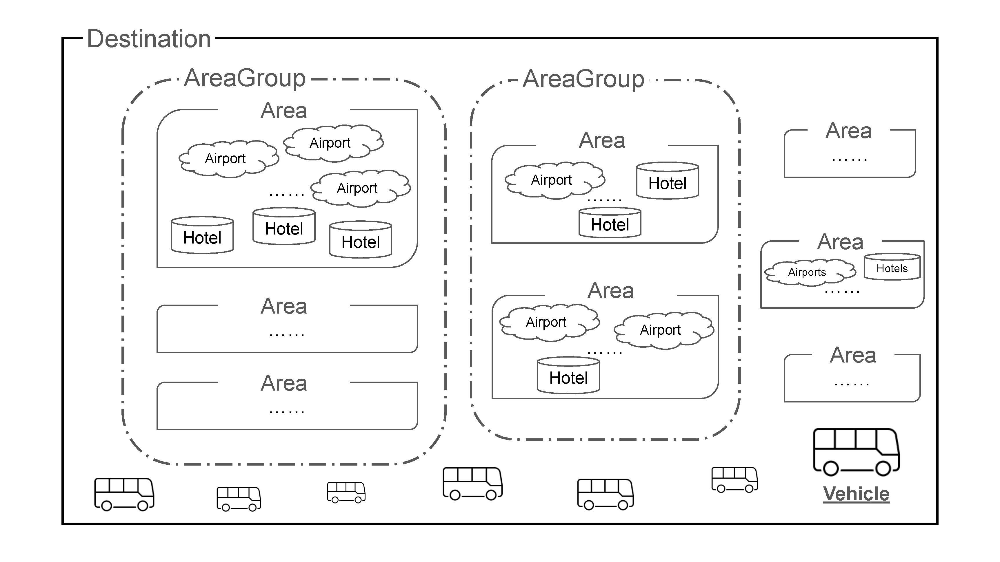

[toc]

# Product Overview

The Continuous Planning Service enables TUI’s transfer service to operate efficiently by scheduling, optimizing, and routing TUI’s fleet from advanced pre-planning all the way to day-of operation. 

**[Charlie: Insert product overview diagram]**

# What We're Optimizing For

## Cost Functions

The Continuous Planning System optimizes for cost while following business rules. In order to optimize for cost, we must first define what cost is. Each destination has a specific cost function.

Example 1: Mallorca

Cost = distance travelled


Example 2: Zakynthos

Cost = (# of Vehicle A x cost of vehicle A) + (# of Vehicle B x cost of vehicle B)


In general, destinations where TUI owns their own fleet usually have a simple "distance traveled" cost function like Mallorca, and other destinations that are primarily relying on suppliers have the more complex cost function like Zakynthos.

**[Ask Jacob: Is this how he'd represent Zakynthos cost function?]**

## Business Rules

The Continuous Planning System has been configured with business rules for each destination, in order to comply with local legislation, plan trips that are physically possible given the constraints of the geography, and ensure a great customer experience. The following business rules are applied in most destinations.

| Category            | Business Rule       | Definition                                                   | Usual Value | Specified Where? |
| ------------------- | ------------------- | ------------------------------------------------------------ | ----------- | ---------------- |
| Customer Experience | Max time in vehicle | A trip can only take X amount of time. Does not include time from the first/last stop to the airport. Only affects time between first and last hotel stops. (Minutes) | 40          | Master Data      |
|                     |                     |                                                              |             |                  |
|                     |                     |                                                              |             |                  |

**[To delegate: List all business rules & take a first pass at all values in the table.]**

# Data Exchange Overview


1. **Bookings, Flights, & changes:** TUI sends bookings, flights, & changes to Mobi on a continuous basis via an AWS Kinesis stream. All bookings, flights, & changes are sent this way up until the freeze date (e.g. 2 days prior to planned date).
2. **Booking errors:** If there is an error with a booking, this error is sent back to TUI via AWS SNS. An error may be sent immediately after the booking is received, if the booking could not be stored. If the booking can be stored but an error occurs later during planning, the error will be sent when planning occurs (either 14 days prior to the planned date, or soon after receipt of the booking if sent less than 14 days prior to the planned date).
3. **Manual Changes:** After the freeze date (e.g. <2 days prior to planned date), changes must be made manually via API call. This includes new bookings, changes to bookings, new trips, assigning bookings to trips manually, and requesting a replan.
4. **Manual Change errors:** When manual changes are made via API call, there may be errors, which prevent planning & must be addressed. There may also be warnings (which can be ignored if desired) if the manual changes violate QA rules. Both errors and warnings are sent in the API response.
5. **Master Data Request:** Mobi requests master data from TUI from each destination every 15 minutes, via an API call. This ensures that if there are changes on the TUI side (e.g. *NEED EXAMPLE) the changes will be part of Mobi’s planning. Master data includes elements like (e.g. *NEED EXAMPLES).
6. **Master Data:** In response to Mobi’s API call, TUI sends updated master data. (*DOES TUI SEND ALL OF IT? OR ONLY CHANGES?)
7. **Master Data Update Indicator:** If TUI needs the master data to be updated faster than 15 minutes, TUI can call the Master Data Update Indicator API. (*DO THEY EVER CALL THIS?)
8. **Plans & changes:** Mobi sends plans & changes to TUI via an AWS Kinesis stream. TUI consumes this data and displays it in the Ermes system.
9. **Planning complete message:** Mobi sends a planning complete message via AWS SNS (*DOES TUI USE THIS? WHEN & WHY?)

Each item in this diagram is further described in a section below.

# Bookings & Flights

**Open Questions for CPS team:**

- (Alice) For vehicle_type (which they can specify if they want to force a specific vehicle type):
  - What are all the options that someone could specify? I see "Van / Minivan" as one example in the example booking.
  - Can someone specify multiple options? Or do they have to pick 1?
- (Dan) Is booking_plan_status something TUI sends us? That doesn't make sense to me. Is this something TUI sends us to indicate whether it's a new booking or an updated booking?
  - booking_plan_status: [choice] in {Pending, Planned} if this booking is already planned.

## Bookings & Flights Overview

A **Booking** represents a need for a transfer (a ride in a vehicle) for a group of passengers (1 or more). A group represented in a single **Booking** generally has booked a tour with TUI together, will be on the same flights, and will be staying at the same **Hotel**.

For every group who books a tour with TUI together, there will generally be 2 **Bookings** sent to Mobi because there are 2 transfers. For example, if the group is going to Cancun, there would be the following 2 **Bookings**:

- **Arrival to a destination:** a transfer picks up the group at the Cancun airport & brings them to their hotel
- **Departure from a destination:** a transfer picks up the group at their hotel & brings them to the Cancun airport

Guests that have itineraries involving multiple **Hotels** may have additional transfers, so they would have 1 or more additional **Bookings** with the "Between Hotels" type.

Each **Flight** represents a real flight in the world that corresponds to an **Arrival** to a destination or a **Departure** from a destination where 1 or more groups of passengers will need a transfer. Multiple **Bookings** may correspond to a given **Flight.**

## When Bookings Get Planned

- When a booking comes in via the Kinesis stream, it gets ingested but not planned until the "planning window" for the relevant destination.
- The start of the planning window is specified by the first_planning_time fields, as part of **Parameters**
  - First planning time pickups
  - First planning days pickups
  - First planning time dropoffs
  - First planning days dropoffs
- The end of the planning window is specified by the stop_free_replan fields, as part of the **Destination**
  - Stop free replan time pickups
  - Stop free replan days pickups
  - Stop free replan time dropoffs
  - Stop free replan time dropoffs
- During the planning window for a particular destination & operation date, we check every 5 minutes if there have been any changes to bookings or flights. If we do see changes, we do a replan including all the bookings for the destination & operation date.
- If a booking is locked, it will not be replanned. 


**Open Question:** What are the most common values for the start & end of planning window?


## Sending Bookings & Flights via AWS Kinesis

Bookings & Flights are sent as records in a AWS Kinesis data stream. Records include metadata and a payload. Fields within the record can be sent in any order.

Metadata specifies:

- content-type
  - 'vnd.booking-event.v1' for bookings
  - 'vnd.flight-event.v1' for flights
- operation
  - saved (creating a new booking or flight, or updating it) - requires the booking or flight object with all required fields.
    - If a booking or flight comes in with a new booking_id or flight_id, it will be created
    - If a booking or flight comes in with an existing booking_id or flight_id, it will be updated
    - Booking_id & flight_id are globally unique across destinations & dates
  - deleted (deleting a booking or flight) - requires just the booking_id or flight_id
    - If a booking has already been assigned to a trip, deleting it will remove it from the relevant trip
  - locked (locking a booking) - requires just the booking_id
    - Locking a booking means it will not be replanned & assigned to a new trip
  - unlocked (unlocking a booking) - requires just the booking_id
    - Unlocking a booking means it can be replanned & assigned to a new trip

**Example Booking record:**

```
{'metadata': {'content-type': 'vnd.booking-event.v1', 'X-B3-TraceId': '0', 'operation': 'saved'}, 'payload': {'booking_id': 'ASX-5082-5178600-1', 'touroperator_id': 'TOP 1', 'ext_booking': 'BETWEENHT', 'lead_pax_name': 'ASELA ASELA', 'destination_id': '1', 'total_pax': 2, 'combinable': True, 'transfer_way': 'between hotels', 'force_pickup_datetime': '2023-01-31T15:00:00+01:00', 'origin_point_type': 'Hotel', 'origin_guest_hotel_id': '1', 'origin_stop_hotel_id': '1', 'destination_point_type': 'Hotel', 'destination_guest_hotel_id': '2', 'destination_stop_hotel_id': '2', 'flight_exclusive': False, 'booking_plan_status': 'Pending', 'passengers': [{'passenger_id': 1, 'name': 'ASELA ASELA', 'age': 30}, {'passenger_id': 2, 'name': 'ASELA ASELA', 'age': 30}], 'operation_date': '2023-01-31', 'welfare': False}}
```

**Example Flight record:**

```
{'metadata': {'content-type': 'vnd.flight-event.v1', 'operation': 'saved'}, 'payload': {'flight_id': '10027', 'flight_number': 'VY3832', 'flight_date': '2019-07-01T14:00:00+02:00', 'flight_way': 'Departure', 'origin_terminal_id': '1', 'first_flight': False, 'destination_terminal_id': 'MUC'}}
```

## Fields for Bookings

### Required Fields for All Bookings

| Field            | Type   | Description                                                  | Example                                                      |
| ---------------- | ------ | ------------------------------------------------------------ | ------------------------------------------------------------ |
| booking_id       | string | Unique id for each booking                                   | "ASX-5006-1813434-2"                                         |
| ext_booking      | string | External booking id. If bookings share this value, then they will be grouped together. | "61902535"                                                   |
| transfer_way     | enum   | Whether a booking is an arrival, a departure, or between hotels. Possible values: "Arrival", "Departure", "Between hotels" | "Departure"                                                  |
| operation_date   | date   | Date of transfer (YYYY-MM-DD)                                | "2024-01-13"                                                 |
| total_pax        | int    | Number of passengers as part of the booking who will need a seat? | 2                                                            |
| destination_id   | string | Associated destination                                       | "5006"                                                       |
| touroperator_id  | string | Associated tour operator, identifying rules this booking needs to obey in planning. Usually includes destination_id. | "5006-205747"                                                |
| combinable       | bool   | Whether the booking can be combined with other bookings (e.g. VIP bookings cannot be combined) | "true"                                                       |
| flight_exclusive | bool   | Whether the flight cannot be combined with other flights (e.g. ??) | "false"                                                      |
| welfare          | bool   | Whether the group needs a handicap-accessible vehicle. Handicap-accessible vehicles will only be assigned to bookings where this field is set to true. | "false"                                                      |
| passengers       | dict   | Includes passenger_id (int starting from 1), name (string), & age (int). Upon ingestion of the booking, ages of passengers are checked against min_age (specified in master data per tour operator). By default passengers with age under 2 are assumed to be infants in arms and not require a seat. Mobi does not use the passenger information aside from this age check. | "passengers":[{"passenger_id":1,"name":"Hendrik Rauh","age":54},{"passenger_id":2,"name":"Grit Berghof","age":50}] |

### Required Fields for Arrivals

| Field                     | Type   | Description                                                  | Example             |
| ------------------------- | ------ | ------------------------------------------------------------ | ------------------- |
| origin_flight_id          | string | Associated flight id. Usually includes destination_id.       | "ASX-5175-347722-1" |
| destination_stop_hotel_id | string | Hotel id for the hotel where the transfer should drop the guests off. Usually includes destination_id. | "5175-64985"        |

### Required Fields for Departures

| Field                    | Type   | Description                                                  | Example            |
| ------------------------ | ------ | ------------------------------------------------------------ | ------------------ |
| destination_flight_id    | string | Associated flight id. Usually includes destination_id.       | "ASX-5006-1333547" |
| origin_stop_hotel_id     | string | Hotel id for the hotel where the transfer should pick up the guests. Usually includes destination_id. | "5006-7729"        |
| presentation_window_from | int    | How many minutes **at most** the transfer can arrive at the airport before the flight departure time. e.g. 180 means the transfer can arrive at most 3 hours before the flight departure. | 180                |
| presentation_window_to   | int    | How many minutes **at least** the transfer can arrive at the airport before the flight departure time. e.g. 120 means the transfer can arrive at most 2 hour before the flight departure. | 120                |

### Optional Fields

| Field                  | Type     | Description                                                  | Example                     |
| ---------------------- | -------- | ------------------------------------------------------------ | --------------------------- |
| force_pickup_datetime  | datetime | Force planning to use a specific time for pickup for this booking | "2024-05-05T18:15:00-04:00" |
| force_dropoff_datetime | datetime | Force planning to use a specific time for dropoff for this booking | "2024-05-05T18:15:00-04:00" |
| vehicle_type           | enum     | Force planning to use a specific type of vehicle for this booking. Any vehicle type specified in the master data for the associated destination is valid. | "Van / Minivan"             |

### Fields TUI Sends but Mobi Does Not Use

If these fields are not sent as part of a booking, we will not send an error. **(Check if this is true)**

| Field                                           | Type   | Description                                                  |
| ----------------------------------------------- | ------ | ------------------------------------------------------------ |
| destination_guest_hotel_id                      | string | Hotel id for the hotel where the guests are staying, provided for arrivals. This is not used, because destination_stop_hotel_id is used instead. |
| origin_guest_hotel_id                           | string | Hotel id for the hotel where the guests are staying, provided for departures. This is not used, because origin_stop_hotel_id is used instead. |
| lead_pax_name                                   | string | Lead passenger for the booking                               |
| origin_point_type/destination_point_type        | enum   | "Hotel" or "Terminal". These are not used because transfer_way already defines what the origin & destination point types are. |
| orgin_terminal_type / destination_terminal_type | enum   | "Airport"                                                    |

### Example Bookings

**Arrival Booking**

{"booking_id":"ASX-5175-347722-1","touroperator_id":"5175-212553","ext_booking":"61902535","lead_pax_name":"HENDRIK,  RAUH","destination_id":"5175","total_pax":2,"combinable":true,"transfer_way":"Arrival","operation_date":"2024-01-24","origin_flight_id":"ASX-5175-31293","origin_point_type":"Terminal","origin_terminal_type":"Airport","destination_point_type":"Hotel","destination_guest_hotel_id":"5175-64985","destination_stop_hotel_id":"5175-64985","flight_exclusive":false,"presentation_window_from":0,"presentation_window_to":0,"booking_plan_status":"Pending","passengers":[{"passenger_id":1,"name":"Hendrik Rauh","age":54},{"passenger_id":2,"name":"Grit Berghof","age":50}],"welfare":false}}]}

**Departure Booking**

{"booking_id":"ASX-5006-1813434-2","touroperator_id":"5006-205747","ext_booking":"WRC1A1BU","lead_pax_name":"SR  NICOLE GRUSZYNSKI","destination_id":"5006","total_pax":2,"combinable":true,"transfer_way":"Departure","operation_date":"2024-01-13","origin_point_type":"Hotel","origin_guest_hotel_id":"5006-7729","origin_stop_hotel_id":"5006-7729","destination_flight_id":"ASX-5006-1333547","destination_point_type":"Terminal","destination_terminal_type":"Airport","flight_exclusive":false,"presentation_window_from":180,"presentation_window_to":180,"booking_plan_status":"Planned","passengers":[{"passenger_id":1,"name":"SR  NICOLE GRUSZYNSKI","age":30},{"passenger_id":2,"name":"SR  NICOLE GRUSZYNSKI","age":30}],"welfare":false}}]}

**Between Hotels Booking**

{"booking_id":"ASX-5006-1835811-1","touroperator_id":"5006-42180","ext_booking":"22077510","lead_pax_name":"MALJONEN  EERO  (L)","destination_id":"5006","total_pax":2,"combinable":false,"transfer_way":"Between hotels","vehicle_type":"Van / Minivan","operation_date":"2024-01-12","origin_point_type":"Hotel","origin_guest_hotel_id":"5006-8183","origin_stop_hotel_id":"5006-8183","destination_point_type":"Hotel","destination_guest_hotel_id":"5006-61586","destination_stop_hotel_id":"5006-61586","flight_exclusive":false,"booking_plan_status":"Pending","passengers":[{"passenger_id":1,"name":"MALJONEN  EERO  (L)","age":30},{"passenger_id":2,"name":"MALJONEN  EERO  (L)","age":30}],"welfare":false}}]

## Fields for Flights

### Required Fields for All Flights

| Field                   | Type     | Description                                                  | Example                     |
| ----------------------- | -------- | ------------------------------------------------------------ | --------------------------- |
| flight_id               | string   | Unique id for each flight                                    | "10027"                     |
| flight_number           | string   | Flight number used in the real world for this flight         | "VY3832"                    |
| flight_way              | enum     | Whether a flight is an arrival to a Destination, or a departure from a Destination. Possible values: "Arrival", "Departure". | "Departure"                 |
| flight_date             | datetime | Date/time of flight arrival or departure, depending on the flight_way | "2019-07-01T14:00:00+02:00" |
| destination_terminal_id | string   | ?                                                            | "MUC"                       |
| original_terminal_id    | string   | ?                                                            | "1"                         |

### Optional Fields

### Example Flights

**Example Departure:**

{'flight_id': '10027', 'flight_number': 'VY3832', 'flight_date': '2019-07-01T14:00:00+02:00', 'flight_way': 'Departure', 'origin_terminal_id': '1', 'destination_terminal_id': 'MUC'}}

## Errors

If there is an error with a booking, this error is sent back to TUI via AWS SNS. 

Timing of errors depends on the type of error: 

- An error may be sent immediately after the booking is received, if the booking could not be stored. 
- If the booking can be stored but an error occurs later during planning, the error will be sent when planning occurs.

**Open Questions:**

- (Jamie) How does it work if multiple errors are applicable? We return only the first one? Or the list of all applicable? Is it the same for bookings vs APIs?
- (Jamie) Check whether fields we don't use will throw an error if not included


# APIs: Requesting a Replan, Manual Changes, Warnings, & Errors

## Requesting a Replan

After the freeze date that is configured for the relevant destination (e.g. <2 days prior to planned date), Mobi will not replan automatically even if new bookings, changes to bookings, or changes to flights are received. If a replan is needed then it must be requested via an API call. These replan API calls are triggered by buttons in the Ermes interface.

| Ermes Name | Description                                                  | Use Cases                                                    | API Call                                                     |
| ---------- | ------------------------------------------------------------ | ------------------------------------------------------------ | ------------------------------------------------------------ |
| New Plan   | Create new vehicles to handle these bookings. Don’t affect anything already created. | Hub: ?<br />Airport: ?                                       | [POST /tui-cps/v1/bookings/replan](https://shiny-enigma-qklzoe7.pages.github.io/#/bookings/bookings_replan_create) |
| Full Plan  | Using existing vehicles, make as many changes as you want, domino effect is fine | Hub: ?<br />Airport: ?                                       | POST /tui-cps/v1/bookings/domino_replan                      |
| Light Plan | System only inserts bookings into existing vehicles with enough space, but doesn't add vehicles or change existing bookings. | Airport: ?                                                   | POST /tui-cps/v1/bookings/insertion_replan                   |
| TBD        | Replan all bookings for the rest of the day without changing vehicles, affecting only passengers & vehicles that have not yet arrived at the airport. | Airport: When a flight gets delayed, ensure the affected passengers get an updated transfer plan, moving other passengers around as needed while minimizing the need to request new vehicles. | TBD                                                          |


## Manual Changes

If the replan buttons cannot meet TUI staff's needs in some circumstances, then they can make manual changes to bookings & trips. These manual changes are made via API calls, which are triggered by buttons & other actions in Ermes.

| Ermes Name                         | Description                                                  | Use Cases                                                    | API Call                                                     |
| ---------------------------------- | ------------------------------------------------------------ | ------------------------------------------------------------ | ------------------------------------------------------------ |
| Bulk Assign                        | Assign bookings to existing trips manually                   | Hub: ?<br />Airport: ?                                       | [POST /tui-cps/v1/trips/{id}/bulk_assign_bookings](https://shiny-enigma-qklzoe7.pages.github.io/#/trips/trips_bulk_assign_bookings_create) |
| Edit Parking Number or Sign Number | Using existing vehicles, make as many changes as you want, domino effect is fine | Hub: ?<br />Airport: Assign parking number or change sign number when vehicle arrives to parking, so that airport employees in other places can direct guests to the right parking area and sign number. Especially useful for big airports, replaces the need for calling on walkie talkies and mobile phones to communicate things like this. | [PATCH /tui-cps/v1/trips/{id}](https://shiny-enigma-qklzoe7.pages.github.io/#/trips/trips_partial_update) |
| Create trip                        | Create new trip                                              | Hub: When receiving new bookings or changes to bookings after the freeze date, create a new trip when needed then use bulk assign to assign bookings to that new trip.<br />Airport: ? | [POST /tui-cps/v1/trips](https://shiny-enigma-qklzoe7.pages.github.io/#/trips/trips_create) |
| Lock                               | Lock a trip so that changes cannot be made by replans        | Hub: ?<br />Airport: ?                                       | POST /tui-cps/v1/trips/lock_trips                            |
| Bulk Unassign                      | Unassign bookings from trips manually                        | Hub: ?<br />Airport: ?                                       | [POST /tui-cps/v1/bookings/bulk_unassign](https://shiny-enigma-qklzoe7.pages.github.io/#/bookings/bookings_bulk_unassign_create) |
| Delete Trip                        | Delete a specific trip                                       | Hub: ?<br />Airport: ?                                       | [DELETE /tui-cps/v1/trips/{id}](https://shiny-enigma-qklzoe7.pages.github.io/#/trips/trips_destroy) |

## Warnings

## Errors

# Master Data

## Overview

Master Data includes information about physical places and the business rules that should apply to relevant bookings during planning. Business rules specified in the bookings themselves generally override business rules supplied in Master Data. 

## Key Concepts in Master Data



As shown in the image above, one **Destination** can have multiple **Area Groups**. One **Area Group** can have multiple **Areas**, but an **Area** does not have to belong to an **AreaGroup**. One **Area** can have multiple **Airports** and multiple **Hotels**. **Vehicles** are specified per destination.

## Destinations

Destinations tend to be either islands or broad regions surrounding a major city. Island destinations include Mallorca and Zakynthos. Other destinations include Antalya and Cancún.

**Destination Example:** 
{'id': '5002', 'destination_name': 'Punta Cana', 'company': 'DO0', 'office': 3, 'transport_stations': ['AZS', 'EPS', 'HEX', 'JBQ', 'LRM', 'PLRMP', 'POP', 'PSDG', 'PSDQP', 'PUJ', 'SDQ', 'STI'], 'transport_setup': {'qa_rule_id': 163, 'time_zone': 'America/Santo_Domingo', 'solver_calculation': 'cost', 'presentation_time_average': 'max', 'combinable_sign_from': 1, 'combinable_sign_to': 99, 'non_combinable_sign_from': 200, 'non_combinable_sign_to': 299, 'stop_free_replan_time_pickups': '08:00:00', 'stop_free_replan_days_pickups': 1, 'stop_free_replan_time_dropoffs': '08:00:00', 'stop_free_replan_days_dropoffs': 2, 'real_cost': True, 'round_times': True, 'back_to_back_sign': 'original', 'group_by_hotelflight': True, 'private_veh_capacity_behaviour': 'none'}}

## Transport Stations: Airports & Ports

Airports & ports map to airports & ports in the real world. There may be multiple airports & ports in one destination, but many have just one airport. These are specified as "transport stations" in the master data.

**Airport Example:**
{'id': 'AAQ', 'name': 'ANAPA', 'transport_station_type': 'airport'}, {'id': 'AAR', 'name': 'AARHUS', 'transport_station_type': 'airport'}

**Port Example:** 

{'id': '0GRC2', 'name': 'Zakynthos Port', 'transport_station_type': 'harbour'}

### Terminals

Terminals map to airport terminals in the real world. One airport can have multiple terminals, while one terminal can only belong to one airport (specified as transport_station_id).

**Terminal Example:** 

{'id': 'AAT', 'transport_station_id': 'AAT', 'name': 'ALTAY'}


## Hotels

Hotels map to hotels in the real world. There are generally many hotels per destination.

**Hotel Example:**
{'id': '5016-100393', 'area_id': '5016-LAGANAS', 'name': 'Majestic Spa', 'address': ', LAGANAS, 291 00 ZAKYNTHOS, GRECIA', 'destination_id': '5016', 'cmd_id': 'AC18743631', 'transport_setup': {'location': [37.72782089288549, 20.86380683604017], 'exclusive_hotel': False, 'first_stop': False, 'hotel_pickup_setups': [], 'audit_date': '2023-07-26T06:51:40.487941Z'}}

**HotelGroup**: destination-level. One hotelGroup can have multiple hotels but hotel does not have to belong to a HotelGroup. It specifies hotel's wait time.

Example:
{'id': 18, 'name': 'CABINA CASA DE CAMPO', 'destination_id': '5002', 'checkpoint_waiting_time_arrival': 3, 'checkpoint_waiting_time_departure': 5}

**HotelStoppriorities**: destination-level. Determine which hotels are prioritized and visited earlier than other areas in a certain transfer_way trip.

Example:
{'id': '0ce0fb1d-a48b-49b5-9361-4477297d8a94', 'destination_id': '5016', 'transfer_way': 'departure', 'name': 'LAGANAS-KALAM', 'hotels': ['5016-194208', '5016-438487', '5016-438488', '5016-231664', '5016-466222', '5016-400419', '5016-432138', '5016-122142', '5016-183338', '5016-202842', '5016-194212', '5016-355229', '5016-15420', '5016-76715', '5016-15609', '5016-139864', '5016-139862', '5016-8107', '5016-136732', '5016-139863', '5016-356035', '5016-432320', '5016-194215', '5016-194216', '5016-356497', '5016-444382', '5016-354857', '5016-465879', '5016-125775', '5016-15638', '5016-154198', '5016-194219', '5016-15688', '5016-200473', '5016-194222', '5016-438790'], 'enabled': True}


## Vehicles

**Vehicles** map to vehicles available for transporting passengers in the real world, either part of TUI's fleet or available from suppliers.

Each **Destination** has **Vehicles** specified separately. Attributes of a vehicle include type of vehicle, number of seats, quantity of vehicles available. When quantity equals to -1, it means we can consider there are "unlimited" number of this vehicle.

Vehicle Example:
{'id': '5016-ADAPTED VEHICLE-GR0-E', 'destination_id': '5016', 'code': 'ADAPTED VEHICLE', 'name': 'ADAPTED VEHICLE RAMP', 'vehicle_type_id': '5016-E', 'transport_setup': {'show_sign_at': ['none']}}

### Suppliers

Each vehicle has one supplier, and suppliers generally have multiple vehicles.

Suppliers are specified per destination. If the same supplier provides vehicles in multiple destinations, it is specified as a spearate supplier per destination.

(What's the supplier name for TUI-owned fleet?)

**Supplier Example:**
{'id': '5016-4111', 'name': 'TUI HELLAS - ZTH', 'destination_id': '5016', 'sap_code': '0000224308', 'transport_setup': {'live_tracking_enabled': False, 'no_transfer': False, 'allow_multiple_b2b': False}}

### Prices

Many Destinations have cost functions structured like so:

Cost = (# of Vehicle A x cost of vehicle A) + (# of Vehicle B x cost of vehicle B)

In this case, Mobi needs a price for each vehicle. These prices are per X.

Vehicle can have multiple prices while price can also belong to multiple vehicles. It shows price for the linked vehicle to hold passengers (number of the passengers is greater than pax_min and less than pax_max) from origin_point to destination_point (usually area object or terminal object). 

**Price Example:**
{'id': 1262, 'destination_id': '5016', 'origin': 'ZTH', 'origin_type': 'airport', 'destination': '5016-BOCHALI', 'destination_type': 'area', 'date_from': '2022-04-22', 'date_to': '2022-12-31', 'price_type': 'unit', 'min_nro_pax': 4, 'max_nro_pax': 16, 'price': 39.24, 'currency_id': 'EUR'}

## Areas

**Area Example:**
{'id': '5016-AGDIMITRIS', 'description': 'Agios Dimitris', 'destination_id': '5016', 'destination_name': 'ZTH', 'transport_setup': {'exclusive_area': False, 'locks_setup': [], 'audit_date': '2023-04-12T06:36:39.349174Z', 'area_penalty': 0, 'feeder': False, 'feeder_time_in_advance': 0}}

**AreaIncompatibilities**: destination-level. Determine which areas are incompatible with each other when planning a certain transfer_way trip associated with a certain terminal.

Example:
{'id': 687, 'destination_id': '5016', 'transfer_way': 'arrival', 'incompatibility_areas': ['5016-ALYKANAS', '5016-AGSOSTIS'], 'date_from': '2022-11-16', 'date_to': '2030-12-31', 'enabled': True}

**AreaStopPriorities**: destination-level. Determine which areas are prioritized and visited earlier than other areas in a certain transfer_way trip.

Example:
{'id': 'a2851fa1-5cb1-48a1-9954-e03fa4a5bdb4', 'destination_id': '5016', 'transfer_way': 'arrival', 'name': 'ARRIVAL AREA ORDER', 'areas': ['5016-KALAMAKI', '5016-LAGANAS'], 'enabled': True}


## Tour Operators

Tour Operators are organizations that run tours in a specific destination. Business rules are primarily set on a tour operator level, by specifying a set of parameters by qa_rule_id for a given tour operator. Tour operators also specify (what is exclusive_to, what is private_veh_capacity_behaviour)?

Example:
{'id': '5016-212177', 'name': 'ABAX', 'short_name': 'ABAXS', 'destination_id': '5016', 'sap_code': '0001093579', 'client_type': '3p_b2b', 'transport_setup': {'qa_rule_id': 48, 'exclusive_to': 'both', 'private_veh_capacity_behaviour': 'none'}}

### Tour Operator Hotel Configurations

An optional piece of master data that can be sent to specify if this hotel is exclusive (not combinable with bookings from other hotels) or first_stop (the hotel should be prioritized).

**TourOperatorHotelConfigurations Example:**
 {'id': 589, 'touroperator_id': '5032-212614', 'hotel_id': '5032-2933', 'exclusive_hotel': True, 'first_stop': False, 'destination_id': '5032'}


## Parameters 

## Master Data Format

[Reference in .yaml format](https://musical-guide-gq4eyjv.pages.github.io/#/)

## Request

## Master Data Contents

## Master Data Update Indicator

# Plans & Changes

## Plans

## Changes

# Next Tasks To Delegate

- Flights (1 hour ish). Alice? Fields with type, description, example - call out if certain fields are required vs optional, and if there are any TUI sends us but does not use. Example flight.

# (Notes to self)

We can link to other docs in this repo [another_file.md](./another_file.md)

Miscellaneous questions - check if we covered these:

- Once TUI sends us bookings, how will they know that we successfully planned or didn’t?
- How & when & in what format do we send error messages? (I think we send these via SNS).
- How do we send them back the plans? 
- What happens if they send us too many bookings at once? (like that one time they did this) How many do we expect they will send at maximum in what span of time, so they give us a heads up if they ever plan to send more?