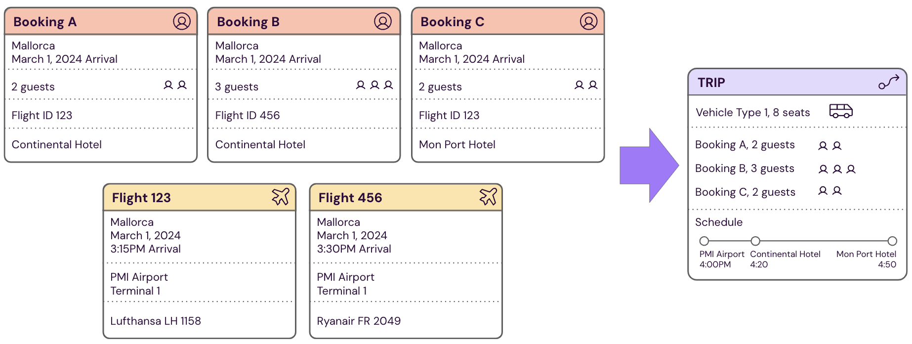
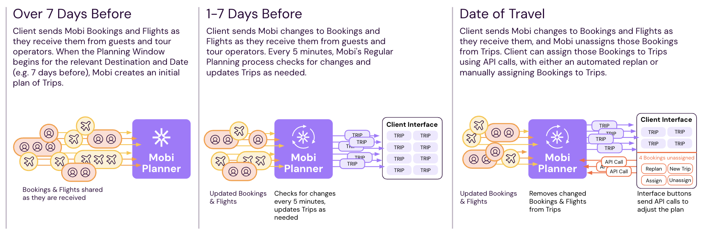
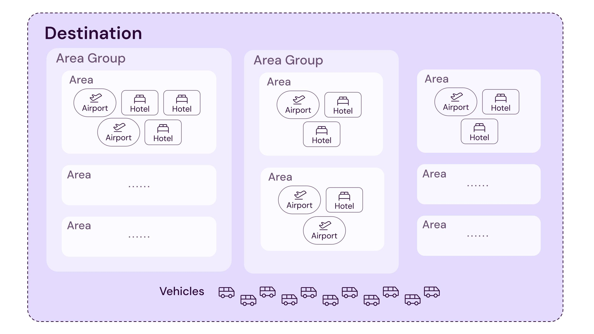

# Mobi Continuous Planning Service - Implementation for TUI

## Table of Contents

[Overview](#overview)

[Bookings and Flights](#bookings-and-flights)

[Regular Planning](#regular-planning)

[Trips](#trips)

[APIs](#apis)

[Master Data](#master-data)


# Overview

**TUI's Transfer Service** provides guests with a ride from the airport to their hotel and back for most tours, to ports and back for cruises, and between hotels for multi-hotel vacations. Each one-way ride is a **Transfer**. Mobi's Continuous Planning Service enables TUI’s Transfer Service to operate efficiently by scheduling optimized trips with TUI’s fleet in advance and enabling fast on-the-fly adjustments in response to disruptions like flight delays or vehicle breakdowns.

## Inputs and Outputs

The Mobi Planner turns **Bookings** and **Flights** into **Trips**. For a single tour, a group of guests will have 2 separate Bookings for their **Arrival** to the tour **Destination** and their **Departure** from the tour Destination.

### Example Bookings, Flights, and Trip for 3 Arrivals to Palma de Mallorca



## Data Flow Overview

The image below shows the timing around how the Mobi Planner turns Bookings and Flights into Trips, as well as how planning staff can affect Trips more directly using buttons in the client interface.

### Data Flow Diagram: 1 Date in 1 Destination



## Amazon Web Services (AWS) and API Interfaces

- **Inputs:** [Bookings and Flights](#bookings-and-flights) are streamed to Mobi via an AWS Kinesis Data Stream
- **Outputs:** [Trips](#trips) are streamed back to the client via an AWS Data Stream
- **Data Validation:** Any data issues identified in data validation checks are reported via AWS SNS. This includes [Kinesis Ingestion Data Validation](#kinesis-ingestion-data-validation) and [Pre-planning Data Validation](#pre-planning-data-validation).
- **APIs:** Mobi REST [APIs](#apis) can be called by the client in order to make adjustments to plans as needed. These API calls can be triggered via the client's interface for staff, e.g. via buttons in a web portal that shows the Trips. If requests cannot be parsed, then they will return an error code in the API response. If requests are parsed successfully but an issue prevents the Mobi Planner from acting on the API call, [Invalid and Infeasible Messages](#invalid-and-infeasible-messages) will be sent via AWS SNS.
- **Master Data:** [Master Data](#master-data) is relatively static data that includes information about physical places and the business rules that should apply to relevant bookings during planning. The client can provide REST APIs for Mobi to call regularly to update Master Data, and can optionally send updates via an AWS Data Stream as well with specific information about what Bookings should be updated.

## Regular Planning Overview

1. When a Booking comes in via the AWS Kinesis Data Stream, it gets ingested but not planned until the **Planning Window** for the relevant destination. For most Destinations, the Planning Window begins 7 days before the date of travel and ends 24 hours before the time of travel.
2. Every 5 minutes, the Mobi Planner runs Regular Planning. First, it checks to see if any Bookings within their Planning Window are new, have been updated, or have had updates to their corresponding Flight. Then, it plans the changed Bookings and any other Bookings that could potentially be on the same Trip (e.g. Bookings in the same Destination on the same date of travel).
3. The Mobi Planner starts by creating an initial solution that satisfies the client's Business Rules. It then rapidly uses a combination of AI algorithms to make changes to the initial solution, improving it until no more improvements can be made.
4. The Continuous Planning System computes the timing for each stop within the trip based on Mobi's internal routing engine, then validates that the solution passes a set of criteria including the client's Business Rules (e.g. passengers don't spend more than the maximum time waiting at the airport)
5. The Continous Planning System sends the Trips that have been planned to the client.

*Plan output format, data validation during planning, and how the planning window is specified are covered in more detail in [Regular Planning](#regular-planning).*

## After the Planning Window

Once the Planning Window ends for a particular Destination & date of travel, Regular Planning no longer affects those Bookings. However, changes to Bookings or Flights will have the following effects:

- If a Booking changes, the Booking will be dropped from the Trip and the Trip's schedule of stops will adjust as needed. The changed Booking will no longer be assigned to a Trip, and API calls will need to be used to assign it to a Trip.
- If a Flight changes, all Bookings involving that flight will be dropped from their Trips, and those Trips' schedules will adjust as needed. Those Bookings will no longer be assigned to Trips, and API calls will need to be used to assign it to a Trip.

## API Overview

API calls enable planning staff to make adjustments to plans as needed. These API calls can be triggered via the client's interface for staff, e.g. via buttons in a web portal that shows the Trips. 

### Example API Use Cases

- After the Planning Window, if Bookings have changed and have been unassigned from Trips, they need to be assigned for those guests to have a ride
  - Multiple types of automated replan APIs are available, which will run the Mobi Planner to assign selected Bookings to Trips. The different types of replan vary in how much they can affect other Bookings.
  - Bookings can be assigned to existing Trips manually, if planning staff have a specific idea of what will work best. New Trips can also be created as needed to support this manual adjustment.

- Guests on a Booking are VIPs who need special treatment and planning staff want to keep the plan the same
  - A Booking can be locked so it is not affected by Regular Planning

*Available APIs and use cases are described in more detail in [APIs](#apis).*

## Optimization Overview

### Cost Functions

The Continuous Planning System optimizes for cost while following business rules. In order to optimize for cost, we must first define what cost is. TUI's Transfer Service operates in many tour **Destinations**, which tend to be either islands or broad regions surrounding a major city (e.g Mallorca, Zakynthos, Antalya, Cancún). Each Destination has a specific **Cost Function** that defines the cost to be minimized during planning. The cost function is specified for each Destination in **Master Data**, relatively static data that includes information about physical places and the business rules that should apply to relevant bookings during planning.

There are 2 types of Cost Functions for TUI's Transfer Service:

| Cost Function | Definition                                                   | Usage                                                        | Example Destination |
| ------------- | ------------------------------------------------------------ | ------------------------------------------------------------ | ------------------- |
| Distance      | Cost = distance travelled                                    | Destinations where most transfers use TUI's own fleet        | Mallorca            |
| Cost          | Cost = (# of Vehicle A x cost of Vehicle A) + (# of Vehicle B x cost of Vehicle B) + ... + (# of Vehicle Z x cost of Vehicle Z) | Destinations where most transfers use vehicles contracted from suppliers | Zakynthos           |

### Business Rules

The Continuous Planning System has been configured with **Business Rules** for each Destination, constraints that are in place to plan trips that are physically possible given the realities of the geography and fleets of vehicles, and ensure a great customer experience. Most Business Rules are specified in [Master Data](#master-data), and some are specified in [Bookings](#bookings-and-flights).

Example Business Rules:

| Category             | Business Rule                                       | Purpose                                                      |
| -------------------- | --------------------------------------------------- | ------------------------------------------------------------ |
| Customer Experience  | Maximum wait time in a vehicle after the first stop | Set a limit on how long passengers need to wait in the vehicle to be dropped off  or picked up after other passengers start getting dropped off or picked up |
| Physical Constraints | Vehicle clearance for hotels                        | Prevent incompatible vehicles from being assigned to hotels with limited clearance |
| Fleet Constraints    | Vehicle inventory limits                            | Ensure trips can be completed using the set of vehicles that exists in real life |

## Additional Features

### Ferries

Some tours involve guests arriving in an airport on one island, then taking a ferry to another island to reach their hotel. The Continuous Planning System can handle this case, ensuring the guest has both a transfer from the airport to the port and also from the other port to their hotel.

### Feeders

The feeder feature is useful when there are small groups of hotels away from a main road.

- Arrivals: A large vehicle picks up passengers from the airport and drops them off at a meeting point, so that smaller vehicles (feeders) can pick up smaller groups and take them to their hotels in different directions.
- Departures: Smaller vehicles (feeders) drop passengers off at a meeting point, so that the entire group can be taken to the airport from that meeting point in a large vehicle.


# Bookings and Flights

## Bookings & Flights Introduction

A **Booking** represents a need for a one-way Transfer (a ride in a vehicle) for a group of passengers (1 or more). A group represented in a single Booking generally has booked a tour together, will be on the same flight, and will be staying at the same hotel.

For every group who books a tour together, there will generally be 2 one-way Bookings sent to Mobi because there are 2 one-way Transfers. For example, if the group is going to Cancún, there would be the following 2 one-way Bookings:

- **Arrival** to a tour Destination: a transfer picks up the group at the Cancún airport & brings them to their hotel
- **Departure** from a tour Destination: a transfer picks up the group at their hotel & brings them to the Cancún airport

Guests that have itineraries involving multiple Hotels may have additional transfers, so they would have 1 or more additional Bookings with the "Between Hotels" type.

Each **Flight** represents a real flight in the world that corresponds to an Arrival to a tour Destination or a Departure from a tour Destination where 1 or more groups of passengers will need a transfer. Multiple Bookings may correspond to a given Flight.


## Fields for Bookings

### Required Fields for All Bookings

| Field            | Type   | Description                                                  | Example                                                      |
| ---------------- | ------ | ------------------------------------------------------------ | ------------------------------------------------------------ |
| booking_id       | string | Unique ID for each Booking                                   | "ASX-5006-1813434-2"                                         |
| ext_booking      | string | External ID for the Booking                                  | "61902535"                                                   |
| transfer_way     | enum   | Whether a Booking is an Arrival, a Departure, or between hotels. Possible values: "Arrival", "Departure", "Between hotels" | "Departure"                                                  |
| operation_date   | date   | Date of Transfer (YYYY-MM-DD)                                | "2024-01-13"                                                 |
| total_pax        | int    | Number of passengers as part of the Booking, including infants who do not need a seat | 2                                                            |
| destination_id   | string | Associated Destination for the tour. For an Arrival, this will be where the passengers are arriving to. For a Departure, this will be where the passengers are departing from. | "5006"                                                       |
| touroperator_id  | string | Associated tour operator, identifying rules this booking needs to obey in planning. Each tour operator is specific to a Destination. | "5006-205747"                                                |
| combinable       | bool   | Whether the Booking can be combined with other Bookings (e.g. VIP Bookings cannot be combined) | "true"                                                       |
| flight_exclusive | bool   | Whether the Flight cannot be combined with other Flights. If operators think a flight is likely to be delayed, they may use this field to ensure a delay won't affect a large portion of the plan. | "false"                                                      |
| welfare          | bool   | Whether the group needs a handicap-accessible vehicle. Handicap-accessible vehicles will only be assigned to Bookings where this field is set to true. | "false"                                                      |
| passengers       | dict   | Includes passenger_id (int starting from 1), name (string), & age (int). Upon ingestion of the Booking, ages of passengers are checked against min_age (specified in master data per tour operator). By default passengers with age under 2 are assumed to be infants in arms and not require a seat. Mobi does not use the passenger information aside from this age check. | "passengers":[{"passenger_id":1,"name":"Hendrik Rauh","age":54},{"passenger_id":2,"name":"Grit Berghof","age":50}] |

### Required Fields for Arrivals

| Field                     | Type   | Description                                                  | Example             |
| ------------------------- | ------ | ------------------------------------------------------------ | ------------------- |
| origin_flight_id          | string | Associated Flight ID. String includes destination_id.        | "ASX-5175-347722-1" |
| destination_stop_hotel_id | string | Hotel ID for the hotel where the transfer should drop the guests off. String includes destination_id. | "5175-64985"        |

### Required Fields for Departures

| Field                    | Type   | Description                                                  | Example            |
| ------------------------ | ------ | ------------------------------------------------------------ | ------------------ |
| destination_flight_id    | string | Associated Flight ID. String includes destination_id.        | "ASX-5006-1333547" |
| origin_stop_hotel_id     | string | Hotel id for the hotel where the Transfer should pick up the guests. String includes destination_id. | "5006-7729"        |
| presentation_window_from | int    | How many minutes ***at most*** the transfer can arrive at the airport before the flight departure time. e.g. 180 means the transfer can arrive at most 3 hours before the flight departure. | 180                |
| presentation_window_to   | int    | How many minutes ***at least*** the transfer can arrive at the airport before the flight departure time. e.g. 120 means the transfer can arrive at most 2 hour before the flight departure. | 120                |

### Optional Fields

| Field                  | Type     | Description                                                  | Example                     |
| ---------------------- | -------- | ------------------------------------------------------------ | --------------------------- |
| force_pickup_datetime  | datetime | Force planning to use a specific time for pickup for this Booking. Used for Departures. | "2024-05-05T18:15:00-04:00" |
| force_dropoff_datetime | datetime | Force planning to use a specific time for dropoff for this Booking. Used for Arrivals. | "2024-05-05T18:15:00-04:00" |
| vehicle_type           | enum     | Force planning to use a specific type of vehicle for this booking. Any vehicle type specified in the Master Data for the associated Destination is valid. | "Van / Minivan"             |

### Fields TUI Sends but Mobi Does Not Use

| Field                                           | Type   | Description                                                  |
| ----------------------------------------------- | ------ | ------------------------------------------------------------ |
| booking_plan_status                             | enum   | "Pending" or "Planned"                                       |
| destination_guest_hotel_id                      | string | Hotel ID for the hotel where the guests are staying, provided for Arrivals. This is not used, because destination_stop_hotel_id is used instead. |
| origin_guest_hotel_id                           | string | Hotel id for the hotel where the guests are staying, provided for Departures. This is not used, because origin_stop_hotel_id is used instead. |
| lead_pax_name                                   | string | Lead passenger for the Booking                               |
| origin_point_type/destination_point_type        | enum   | "Hotel" or "Terminal". These are not used because transfer_way already defines what the origin & destination point types are. |
| orgin_terminal_type / destination_terminal_type | enum   | "Airport"                                                    |


### Example Bookings

***Arrival Booking Example*** 

```
{"booking_id":"ASX-5175-347722-1","touroperator_id":"5175-212553","ext_booking":"61902535","lead_pax_name":"HENDRIK,  RAUH","destination_id":"5175","total_pax":2,"combinable":true,"transfer_way":"Arrival","operation_date":"2024-01-24","origin_flight_id":"ASX-5175-31293","origin_point_type":"Terminal","origin_terminal_type":"Airport","destination_point_type":"Hotel","destination_guest_hotel_id":"5175-64985","destination_stop_hotel_id":"5175-64985","flight_exclusive":false,"presentation_window_from":0,"presentation_window_to":0,"booking_plan_status":"Pending","passengers":[{"passenger_id":1,"name":"Hendrik Rauh","age":54},{"passenger_id":2,"name":"Grit Berghof","age":50}],"welfare":false}}]}
```

***Departure Booking Example***

```
{"booking_id":"ASX-5006-1813434-2","touroperator_id":"5006-205747","ext_booking":"WRC1A1BU","lead_pax_name":"SR  NICOLE GRUSZYNSKI","destination_id":"5006","total_pax":2,"combinable":true,"transfer_way":"Departure","operation_date":"2024-01-13","origin_point_type":"Hotel","origin_guest_hotel_id":"5006-7729","origin_stop_hotel_id":"5006-7729","destination_flight_id":"ASX-5006-1333547","destination_point_type":"Terminal","destination_terminal_type":"Airport","flight_exclusive":false,"presentation_window_from":180,"presentation_window_to":180,"booking_plan_status":"Planned","passengers":[{"passenger_id":1,"name":"SR  NICOLE GRUSZYNSKI","age":30},{"passenger_id":2,"name":"SR  NICOLE GRUSZYNSKI","age":30}],"welfare":false}}]}
```

***Between Hotels Booking Example***

```
{"booking_id":"ASX-5006-1835811-1","touroperator_id":"5006-42180","ext_booking":"22077510","lead_pax_name":"MALJONEN  EERO  (L)","destination_id":"5006","total_pax":2,"combinable":false,"transfer_way":"Between hotels","vehicle_type":"Van / Minivan","operation_date":"2024-01-12","origin_point_type":"Hotel","origin_guest_hotel_id":"5006-8183","origin_stop_hotel_id":"5006-8183","destination_point_type":"Hotel","destination_guest_hotel_id":"5006-61586","destination_stop_hotel_id":"5006-61586","flight_exclusive":false,"booking_plan_status":"Pending","passengers":[{"passenger_id":1,"name":"MALJONEN  EERO  (L)","age":30},{"passenger_id":2,"name":"MALJONEN  EERO  (L)","age":30}],"welfare":false}}]
```


## Fields for Flights

### Required Fields for All Flights

| Field                   | Type     | Description                                                  | Example                     |
| ----------------------- | -------- | ------------------------------------------------------------ | --------------------------- |
| flight_id               | string   | Unique ID for each Flight                                    | "10027"                     |
| flight_way              | enum     | Whether a Flight is an Arrival to a tour Destination, or a Departure from a tour Destination. Possible values: "Arrival", "Departure". | "Departure"                 |
| flight_date             | datetime | Date/time of Flight Arrival or Departure, depending on the flight_way | "2019-07-01T14:00:00+02:00" |
| destination_terminal_id | string   | Terminal that Flight arrives in. If an Arrival, use this as the terminal for the booking. | "MUC"                       |
| original_terminal_id    | string   | Terminal that Flight departs from. If a Departure, use this as the terminal for the booking. | "1"                         |

### Fields TUI Sends but Mobi Does Not Use

| Field         | Type   | Description                                          | Example  |
| ------------- | ------ | ---------------------------------------------------- | -------- |
| flight_number | string | Flight number used in the real world for this Flight | "VY3832" |


### Example Flights

***Departure Flight Example:***

```
{'flight_id': '10027', 'flight_number': 'VY3832', 'flight_date': '2019-07-01T14:00:00+02:00', 'flight_way': 'Departure', 'origin_terminal_id': '1', 'destination_terminal_id': 'MUC'}}
```


## Sending Bookings & Flights via AWS Kinesis Data Streams

Bookings & Flights are sent as records in an AWS Kinesis Data Stream. Records include metadata and a payload. Fields within the record can be sent in any order. 

When a Booking comes in via the Kinesis stream, it gets ingested but not planned until the Planning Window for the relevant destination. See [Regular Planning](#regular-planning) for further details.

**Metadata specifies:**

- content-type
  - 'vnd.booking-event.v1' for Bookings
  - 'vnd.flight-event.v1' for Flights
- operation
  - saved (creating a new Booking or Flight, or updating it) - requires the Booking or Flight object with all required fields.
    - If a Booking or Flight comes in with a new booking_id or flight_id, it will be created
    - If a Booking or Flight comes in with an existing booking_id or flight_id, it will be updated
    - The booking_id & flight_id are globally unique across destinations & dates
  - deleted (deleting a Booking or Flight) - requires just the booking_id or flight_id
    - If a Booking has already been assigned to a trip, deleting it will remove it from the relevant trip and will update the trip's schedule as needed
  - locked (locking a Booking) - requires just the booking_id
    - Locking a Booking means it will not be affected by [Regular Planning](#regular-planning)
  - unlocked (unlocking a Booking) - requires just the booking_id
    - Unlocking a Booking means it will be affected by [Regular Planning](#regular-planning)


Payload fields for bookings & flights are specified in these sections:

[Fields for Bookings](#fields-for-bookings)

[Fields for Flights](#fields-for-flights)


***Example Booking record:***

```
{'metadata': {'content-type': 'vnd.booking-event.v1', 'X-B3-TraceId': '0', 'operation': 'saved'}, 'payload': {'booking_id': 'ASX-5082-5178600-1', 'touroperator_id': 'TOP 1', 'ext_booking': 'BETWEENHT', 'lead_pax_name': 'ASELA ASELA', 'destination_id': '1', 'total_pax': 2, 'combinable': True, 'transfer_way': 'between hotels', 'force_pickup_datetime': '2023-01-31T15:00:00+01:00', 'origin_point_type': 'Hotel', 'origin_guest_hotel_id': '1', 'origin_stop_hotel_id': '1', 'destination_point_type': 'Hotel', 'destination_guest_hotel_id': '2', 'destination_stop_hotel_id': '2', 'flight_exclusive': False, 'booking_plan_status': 'Pending', 'passengers': [{'passenger_id': 1, 'name': 'ASELA ASELA', 'age': 30}, {'passenger_id': 2, 'name': 'ASELA ASELA', 'age': 30}], 'operation_date': '2023-01-31', 'welfare': False}}
```

***Example Flight record:***

```
{'metadata': {'content-type': 'vnd.flight-event.v1', 'operation': 'saved'}, 'payload': {'flight_id': '10027', 'flight_number': 'VY3832', 'flight_date': '2019-07-01T14:00:00+02:00', 'flight_way': 'Departure', 'origin_terminal_id': '1', 'first_flight': False, 'destination_terminal_id': 'MUC'}}
```


## Kinesis Ingestion Data Validation

The endpoint **GET /tui-cps/v1/messages** can be used to retrieve a complete set of possible messages that may be sent in AWS Kinesis Data Streams. This section describes one category of messages: **kinesis_rejection** messages.

**kinesis_rejection** messages indicate that a booking or a flight has been sent into the system, but data validation checks upon ingestion from Kinesis indicated that the Booking or Flight had issues which would make it impossible to process. 

Currently, if multiple **kinesis_rejection** error messages are applicable, multiple SNS messages will be sent. ***In the future, a single SNS message will be sent with all the applicable error messages for the booking or flight.***

### Kinesis Rejection Errors for Bookings

| message_id                      | Message                                                      | Description                                                  |
| ------------------------------- | ------------------------------------------------------------ | ------------------------------------------------------------ |
| "KR_unsupported_transfer_type"  | "Kinesis record for booking %(booking_id)s discarded: booking has unsupported transfer type %(transfer_type)s" | transfer_type must be "Arrival", "Departure", or "Between Hotels". Any other value for transfer_type will cause this message. |
| "KR_no_existing_tour_operator"  | "Kinesis record for booking %(booking_id)s discarded: Touroperator %(tour_operator_id)s has not been defined in Master Data" | touroperator_id must match a touroperator object that has been defined in the Master Data for the Destination. If it does not, that will cause this message. |
| "KR_between_hotels_no_pickup"   | "Kinesis record for booking %(booking_id)s discarded: booking between hotels without specified pickup time." | A Booking with transfer_way "Between Hotels" must have a specified pickup time. If it does not, that will cause this message. |
| "KR_between_hotels_same_hotels" | "Kinesis record for booking %(booking_id)s discarded: the origin and destination hotels are the same: %(hotel_id)s" | A Booking with transfer_way "Between Hotels" must specify 2 different hotels, one as origin and one as destination. If the hotel_id is the same for the origin and destination, that will cause this message. |
| "KR_no_terminal_exists"         | "Kinesis record for flight %(flight_id)s discarded: the flight is non-existent and no flight can be created because no terminal is found in master data" | Sometimes Bookings are sent before the corresponding flight record, so Mobi creates a placeholder flight in order to save the booking. Without a terminal in the booking, Mobi cannot create a placeholder flight and cannot save the Booking. |

### Kinesis Rejection Errors for Flights

| message_id                 | Message                                                      | Description                                         |
| -------------------------- | ------------------------------------------------------------ | --------------------------------------------------- |
| "KR_non_existing_terminal" | "Kinesis record for flight %(flight_id)s discarded: Non-existing terminal %(terminal_id)s referenced" | Terminal_id did not match a terminal in Master Data |


# Regular Planning


## Where The Planning Window is Specified

- The start of the planning window for a particular destination is specified by the first_planning_time fields, as part of **Parameters** in Master Data
  - First planning time pickups
  - First planning days pickups
  - First planning time dropoffs
  - First planning days dropoffs
- The end of the planning window for a particular destination is specified by the stop_free_replan fields, as part of the **Destination** in Master Data
  - Stop free replan time pickups
  - Stop free replan days pickups
  - Stop free replan time dropoffs
  - Stop free replan time dropoffs

## Pre-planning Data Validation

The endpoint **GET /tui-cps/v1/messages** can be used to retrieve a complete set of possible messages that may be sent via AWS SNS. This section describes one category: **preprocessing** messages.

At the start of planning, the system runs preprocessing checks to ensure that the bookings are viable for planning. If an error is found, a Booking Discard message is sent via AWS SNS. These messages generally begin with "BD_" where BD stands for Booking Discards.

When a preprocessing error occurs & a Booking Discard message is sent, the Booking is ignored during Regular Planning until it is altered (an updated version is sent either via the AWS Kinesis Data Stream or via API call).


| message_id                             | Message                                                      |
| -------------------------------------- | ------------------------------------------------------------ |
| "BD_no_hotel"                          | "Missing needed hotel"                                       |
| "BD_zero_pax_booking"                  | "Listed with 0 seated passengers."                           |
| "BD_no_area_price"                     | "Booking %(booking_id)s has no price object. Needs price from origin %(origin)s to destination %(destination)s." |
| "BD_missing_ferry_bookings"            | "Associated ferry trip legs are missing"                     |
| "BD_missing_ferry_terminal"            | "Missing the destination/origin point associated with the ferry stop." |
| "BD_missing_feeder_meeting_point"      | "Booking is a feeder but area has no feeder meeting point."  |
| "BD_missing_feeder_main_meeting_point" | "Main booking for feeder is missing the main meeting point"  |
| "BD_dummy_hotel"                       | "Hotel %(hotel_name)s of id %(hotel_id)s is unknown to the planner. It is using the Dummy hotel placeholder" |
| "BD_wrong_coordinates"                 | "Hotel %(hotel_name)s of id %(hotel_id)s has coordinates of 0,0. It is using the Dummy hotel placeholder" |
| "BD_duplicated_locations"              | "Hotel %(hotel_name)s of id %(hotel_id)s has the same location of %(coordinates)s as some other hotels" |
| "BD_dummy_flight"                      | "Flight %(flight_id)s of booking %(booking_id)s is unknown to the planner. It is using flight placeholder info" |
| "BD_invalid_vehicle_type"              | "message": "Vehicle type %(vehicle_type)s does not exists."  |
| "BD_too_large_for_hotel"               | "Listed with %(pax_amount)s seated passengers, but its hotel can only take buses of size %(hotel_capacity)s, vehicles constrained to capacity %(vehicle_capacity)s. Available seats are: %(available_seats)s" |
| "BD_no_vehicle"                        | "There is no vehicle that can accommodate it."               |
| "BD_split_needed"                      | "There is no vehicle that can accommodate it."               |
| "BD_no_ferry"                          | "Unable to assign a ferry to booking %(booking_id)s"         |
| "BD_hotel_invalid"                     | "booking's hotel order is in a circular"                     |
| "BD_feeder_criteria_setup"             | "booking hotel area has two feeder criteria set"             |
| "BD_between_hotels_same_hotels"        | "booking %(booking_id)s between hotels with same destination and origin" |
| "PRIVATE_FEEDER_MAIN_DISCARDED"        | "Not using feeders with the following bookings as they are marked as exclusive: %(bookings)s" |
| "BD_no_more_vehicles"                  | "Unable to satisfy vehicle quantity limits for booking %(booking_id)s" |
| "BD_no_prev_next"                      | "Previous or next transfer booking discarded"                |
| "BD_missing_feeder_booking"            | "Main booking is missing the associated feeder booking."     |
| "BD_missing_main_booking"              | "Feeder booking is missing the associated main booking."     |
| "BD_main_not_configured_for_feeder"    | "Feeder booking is missing a properly-configured main booking" |
| "BD_ftaa_flaw"                         | "Some flaw with flight_terminal_airport_area."               |

# Trips

Trips are sent back as records in a AWS Kinesis Data Stream, each record representing one or more trips. Records include metadata and a payload. 

Each Trip has a unique transfer_id. If a Trip is updated or deleted during regular planning or via API calls, a record will be sent with the same transfer_id as a trip that has been sent previously.

Metadata specifies:

- content-type: vnd.response-planning-event.v1
- operation: saved or deleted

Data includes the following fields:

| Field                | Type   | Description                                                  | Example                                |
| -------------------- | ------ | ------------------------------------------------------------ | -------------------------------------- |
| transfer_id          | string | Unique id for each trip                                      | "8496be06-656f-4403-ae67-b38fa8c5874c" |
| date                 | string | Date of transfer (YYYY-MM-DD)                                | "2024-01-25"                           |
| destination_id       | string | Associated destination                                       | "5006"                                 |
| bookings             | list   | List of bookings, by booking_id                              | ["ASX-5006-1834847-3"]                 |
| vehicle_id           | int    | Type of vehicle                                              | "5006-VAN 8-MX0-V-10080"               |
| vehicle_sign         | string | Sign number for the vehicle (auto-generated 1-99)            | "29"                                   |
| transfer_way         | enum   | Whether a flight is an arrival to a Destination, or a departure from a Destination. Possible values: "arrival", "departure", "between hotels" | "arrival"                              |
| rules                | [int]  | The Parameters object applicable to this trip                | [233]                                  |
| duration             | int    | Duration of trips in minutes, estimated based on local speed limits | 55                                     |
| distance             | int    | Distance in meters                                           | 58922                                  |
| routes               | list   | List of routes. Routes are defined below.                    |                                        |
| remarks              |        |                                                              |                                        |
| combinable           | bool   | Whether this trip contains combinable bookings               | "true"                                 |
| welfare              | bool   | Whether the group needs a handicap-accessible vehicle. Handicap-accessible vehicles will only be assigned to bookings where this field is set to true. | "false"                                |
| exclusive_to         | bool   | Indicates if the trip was planned by an exclusive tour operator | "false"                                |
| change_origin        | enum   | What triggered the planning that output this plan. Options: Solver, Solver-trigger, Solver-replan, Insertion-replan, Dashboard, Supplier, Booking change response, Flight change response | "Dashboard"                            |
| username             | string | Username that made the change that triggered the plan, if applicable | "tui-adfs thamara.villagran@tui.com"   |
| locked               | bool   | Whether this trip is locked and will not be changed in regular planning | "false"                                |
| feasible             | bool   | Whether the trip conforms to applicable business rules. Trips can be made that violate business rules using force_infeasible. | "false"                                |
| infeasibility_reason | string | Infeasible messages relevant to this trip                    | see example below                      |
| total_pax            | int    | Total passengers on this trip                                | 5                                      |
| free_seats           | int    | Number of seats not occupied in vehicle                      | 3                                      |
| total_seats          | int    | Total seats in the vehicle                                   | 8                                      |
| available_seats      | int    | Number of free_seats available for passenger usage. When COVID-19 restrictions were in place limiting the % of capacity that could be filled, available_seats was less than free_seats. | 3                                      |


Routes include the following fields:

| Field                   | Type     | Description                                                  | Example                                |
| ----------------------- | -------- | ------------------------------------------------------------ | -------------------------------------- |
| stop_order              | int      | Number of the stop, in order. First stop is 0, then stops increment by 1. | 0                                      |
| date_time               | datetime | Datetime of stop                                             | "2024-01-25T15:55:00+00:00"            |
| stop_id                 | string   | Unique id for this stop on this trip                         | "b1db04fa-719f-470f-b06f-55b03af0c260" |
| feeder_meeting_point    | bool     | Whether the stop is a feeder meeting point, where other vehicles will pick up or drop off passengers for these bookings | false                                  |
| pickup_bookings         | list     | List of bookings, by booking_id, that will be picked up at this stop | ["ASX-5006-1834847-3"]                 |
| dropoff_bookings        | list     | List of bookings, by booking_id, that will be dropped off at this stop | ["ASX-5006-1834847-3"]                 |
| point_type              | enum     | One of the following: Shuttle, Hotel, Terminal.              | "Terminal"                             |
| terminal_type           | enum     | If point_type is "Terminal", the type of terminal. Currently "Airport" is the only value. | "Airport"                              |
| terminal_id             | string   | If point_type is Terminal, the id of the terminal            | "CUN-NA"                               |
| stop_hotel_id           | string   | If point_type is Hotel, the id of the hotel. This generally includes the destination. | "5006-15902"                           |
| distance_from_last_stop | int      | Distance from last stop (km)                                 | 59                                     |


***Example Plan Record With One Booking:***

```
{'Data': '{"metadata": {"content-type": "vnd.response-planning-event.v1", "operation": "saved"}, "payload": {"transfer_id": "8496be06-656f-4403-ae67-b38fa8c5874c", "date": "2024-01-25", "destination_id": 5006, "bookings": ["ASX-5006-1834847-3"], "vehicle_id": "5006-VAN 8-MX0-V-10080", "vehicle_sign": "29", "transfer_way": "arrival", "rules": ["233"], "duration": 55, "distance": 58922, **"routes": [{"stop_order": 0, "date_time": "2024-01-25T15:55:00+00:00", "stop_id": "b1db04fa-719f-470f-b06f-55b03af0c260", "feeder_meeting_point": false, "pickup_bookings": ["ASX-5006-1834847-3"], "point_type": "Terminal", "terminal_type": "Airport", "terminal_id": "CUN-NA", "distance_from_last_stop": 0}, {"stop_order": 1, "date_time": "2024-01-25T16:45:00+00:00", "stop_id": "3bf35cb0-7f14-485c-a73c-80c02a085ed7", "feeder_meeting_point": false, "dropoff_bookings": ["ASX-5006-1834847-3"], "point_type": "Hotel", "stop_hotel_id": "5006-15902", "distance_from_last_stop": 59}],** "remarks": [], "combinable": true, "welfare": false, "exclusive_to": false, "change_origin": "Dashboard", "username": "[tui-adfs_thamara.villagran@tui.com](mailto:tui-adfs_thamara.villagran@tui.com)", "locked": true, "feasible": true, "infeasibility_reason": [], "total_pax": 5, "free_seats": 3, "total_seats": 8, "available_seats": 3}
```


***Example Plan Record with Multiple Bookings:***

```
[{'Data': '{"metadata": {"content-type": "vnd.response-planning-event.v1", "operation": "saved"}, "payload": {"transfer_id": "26b4036c-4d43-437c-9df9-69b6dd4c1976", "date": "2024-02-01", "destination_id": 5006, "bookings": ["ASX-5006-1852517-1", "ASX-5006-1726004-4", "ASX-5006-1851818-2", "ASX-5006-1849003-2", "ASX-5006-1716845-2", "ASX-5006-1797645-2", "ASX-5006-1849895-2", "ASX-5006-1834914-2"], "vehicle_id": "5006-MINIVAN LUXE-MX0-W-5155", "vehicle_sign": "60", "transfer_way": "departure", "rules": ["236"], "duration": 65, "distance": 43128, **"routes": [{"stop_order": 0, "date_time": "2024-02-01T17:15:00+00:00", "stop_id": "802b983f-9895-42aa-a37c-812781a6afbe", "feeder_meeting_point": false, "pickup_bookings": ["ASX-5006-1726004-4", "ASX-5006-1852517-1"], "point_type": "Hotel", "stop_hotel_id": "5006-443319", "distance_from_last_stop": 0}, {"stop_order": 1, "date_time": "2024-02-01T17:25:00+00:00", "stop_id": "ad97a5c1-0236-48c5-a000-ee3ac0ef7a0a", "feeder_meeting_point": false, "pickup_bookings": ["ASX-5006-1716845-2", "ASX-5006-1797645-2", "ASX-5006-1849003-2", "ASX-5006-1851818-2"], "point_type": "Hotel", "stop_hotel_id": "5006-18925", "distance_from_last_stop": 1}, {"stop_order": 2, "date_time": "2024-02-01T17:35:00+00:00", "stop_id": "a89b5af1-1637-4aa9-9415-694b808bc77f", "feeder_meeting_point": false, "pickup_bookings": ["ASX-5006-1834914-2", "ASX-5006-1849895-2"], "point_type": "Hotel", "stop_hotel_id": "5006-89556", "distance_from_last_stop": 0}, {"stop_order": 3, "date_time": "2024-02-01T18:15:00+00:00", "stop_id": "d59dbae9-90a0-429e-8000-6aada3cced1e", "feeder_meeting_point": false, "dropoff_bookings": ["ASX-5006-1716845-2", "ASX-5006-1726004-4", "ASX-5006-1797645-2", "ASX-5006-1834914-2", "ASX-5006-1849003-2", "ASX-5006-1849895-2", "ASX-5006-1851818-2", "ASX-5006-1852517-1"], "point_type": "Terminal", "terminal_type": "Airport", "terminal_id": "SJD", "distance_from_last_stop": 42}],** "remarks": [], "cost": {"amount": 87.39, "currency_id": "USD"}, "combinable": true, "welfare": false, "exclusive_to": false, "change_origin": "Dashboard", "username": "[tui-adfs_ramon.estrada@ds.destinationservices.com](mailto:tui-adfs_ramon.estrada@ds.destinationservices.com)", "locked": true, "feasible": true, "infeasibility_reason": [], "total_pax": 15, "free_seats": 1, "total_seats": 16, "available_seats": 1}
```


***Example Plan Marked as Infeasible, with Infeasible Reasons:***

```
[{'Data': '{"metadata": {"content-type": "vnd.response-planning-event.v1", "operation": "saved"}, "payload": {"transfer_id": "1b0b3358-f7fb-4d89-b736-a4fe33c1a4e7", "date": "2024-01-30", "destination_id": 5002, "bookings": ["ASX-5002-1573584-1", "ASX-5002-1615065-1", "ASX-5002-1475614-1", "ASX-5002-1552413-1"], "vehicle_id": "5002-PENDFLIGHT-DO0-B-4507", "vehicle_sign": "777", "transfer_way": "arrival", "rules": ["163"], "duration": 70, "distance": 39516, **"routes": [{"stop_order": 0, "date_time": "2024-01-30T04:00:00+00:00", "stop_id": "29c4717c-7e19-44ba-ba1b-dbfc73ef1507", "feeder_meeting_point": false, "pickup_bookings": ["ASX-5002-1475614-1", "ASX-5002-1552413-1", "ASX-5002-1573584-1", "ASX-5002-1615065-1"], "point_type": "Terminal", "terminal_type": "Airport", "terminal_id": "PUJ", "distance_from_last_stop": 0}, {"stop_order": 1, "date_time": "2024-01-30T04:20:00+00:00", "stop_id": "d1cee5b7-bacd-4d83-83a1-4779f7490509", "feeder_meeting_point": false, "dropoff_bookings": ["ASX-5002-1573584-1"], "point_type": "Hotel", "stop_hotel_id": "5002-110057", "distance_from_last_stop": 17}, {"stop_order": 2, "date_time": "2024-01-30T04:50:00+00:00", "stop_id": "4d1e6e06-5062-44bf-bdcb-1142f9ccba6c", "feeder_meeting_point": false, "dropoff_bookings": ["ASX-5002-1615065-1"], "point_type": "Hotel", "stop_hotel_id": "5002-89230", "distance_from_last_stop": 19}, {"stop_order": 3, "date_time": "2024-01-30T05:00:00+00:00", "stop_id": "8d040015-550e-474c-8010-70b4d39ea2ca", "feeder_meeting_point": false, "dropoff_bookings": ["ASX-5002-1475614-1", "ASX-5002-1552413-1"], "point_type": "Hotel", "stop_hotel_id": "5002-428818", "distance_from_last_stop": 3}]**, "remarks": [], "combinable": true, "welfare": false, "exclusive_to": false, "change_origin": "Dashboard", "username": "[tui-adfs_aneury.calderon@tui.com](mailto:tui-adfs_aneury.calderon@tui.com)", "locked": true, "feasible": false, "infeasibility_reason": ["T_ERR_015\\tBookings {\'ASX-5002-1475614-1\', \'ASX-5002-1615065-1\', \'ASX-5002-1552413-1\', \'ASX-5002-1573584-1\'} have incompatible areas.", "T_ERR_025\\tTrip 1b0b3358-f7fb-4d89-b736-a4fe33c1a4e7 with 4 flights violates maximum number of grouped flights"], "total_pax": 11, "free_seats": 766, "total_seats": 777, "available_seats": 766}
```


# APIs

## Requesting a Replan

After the freeze date that is configured for the relevant destination (e.g. <2 days prior to planned date), Mobi will not replan automatically even if new bookings, changes to bookings, or changes to flights are received. If a replan is needed then it must be requested via an API call. These replan API calls are triggered by buttons in the Ermes interface.

| Ermes Name | Mobi Name        | Description                                                  | Use Cases                                                    | API Call                                                     |
| ---------- | ---------------- | ------------------------------------------------------------ | ------------------------------------------------------------ | ------------------------------------------------------------ |
| New Plan   | Replan           | Create new trips to handle these bookings, without affecting existing trips. | Hub: ?<br />Airport: ?                                       | [POST /tui-cps/v1/bookings/replan](https://shiny-enigma-qklzoe7.pages.github.io/#/bookings/bookings_replan_create) |
| Full Plan  | Domino Replan    | Solver will plan the selected bookings and may make any changes needed to the existing plan to maintain optimality. | Hub: ?<br />Airport: ?                                       | POST /tui-cps/v1/bookings/domino_replan                      |
| Light Plan | Insertion Replan | To the extent possible, the solver will insert selected bookings into existing trips without changing the vehicles used. The remaining bookings will be planned seperately. | Airport: ?                                                   | POST /tui-cps/v1/bookings/insertion_replan                   |
| [TBD]      | [TBD]            | Replan all bookings for the rest of the day without changing vehicles, affecting only passengers & vehicles that have not yet arrived at the airport. | Airport: When a flight gets delayed, ensure the affected passengers get an updated transfer plan, moving other passengers around as needed while minimizing the need to request new vehicles. | TBD                                                          |


## Manual Changes

If the replan buttons cannot meet TUI staff's needs in some circumstances, then they can make manual changes to bookings & trips. These manual changes are made via API calls, which are triggered by buttons & other actions in Ermes.

| Ermes Name                         | Description                                                  | Use Cases                                                    | API Call                                                     |
| ---------------------------------- | ------------------------------------------------------------ | ------------------------------------------------------------ | ------------------------------------------------------------ |
| Bulk Assign                        | Assign bookings to existing trips manually. Mobi's solver will update the vehicle & optimize the route. | Hub: ?<br />Airport: ?                                       | [POST /tui-cps/v1/trips/{id}/bulk_assign_bookings](https://shiny-enigma-qklzoe7.pages.github.io/#/trips/trips_bulk_assign_bookings_create) |
| Edit parking number or sign number | Edit parking number or sign number                           | Hub: ?<br />Airport: Assign parking number or change sign number when vehicle arrives to parking, so that airport employees in other places can direct guests to the right parking area and sign number. Especially useful for big airports, replaces the need for calling on walkie talkies and mobile phones to communicate things like this. | [PATCH /tui-cps/v1/trips/{id}](https://shiny-enigma-qklzoe7.pages.github.io/#/trips/trips_partial_update) |
| Create trip                        | Create new trip with specified bookings, vehicle, and sign number | Hub: When receiving new bookings or changes to bookings after the freeze date, create a new trip when needed then use bulk assign to assign bookings to that new trip.<br />Airport: ? | [POST /tui-cps/v1/trips](https://shiny-enigma-qklzoe7.pages.github.io/#/trips/trips_create) |
| Lock                               | Lock a trip so that changes cannot be made by replans        | Hub: ?<br />Airport: ?                                       | POST /tui-cps/v1/trips/lock_trips                            |
| Bulk Unassign                      | Unassign bookings from trips manually. Mobi's solver will update the vehicle & optimize the route. | Hub: ?<br />Airport: ?                                       | [POST /tui-cps/v1/bookings/bulk_unassign](https://shiny-enigma-qklzoe7.pages.github.io/#/bookings/bookings_bulk_unassign_create) |
| Delete Trip                        | Delete a specific trip                                       | Hub: ?<br />Airport: ?                                       | [DELETE /tui-cps/v1/trips/{id}](https://shiny-enigma-qklzoe7.pages.github.io/#/trips/trips_destroy) |

## Invalid and Infeasible Messages

When these APIs are called, there are 3 possible types of responses:

- Success - The API call succeeded and will take effect
- Invalid - The request cannot be completed, because a required field is missing or a critical constraint would be violated. More information about the specific issue will be provided in the response.
- Infeasible - The request will not be completed, because it violates business rules. If the request is re-sent with "force_infeasible" set to True, the request can be completed. More information about the specific issue will be provided in the response.


The endpoint **GET /tui-cps/v1/messages** can be used to retrieve a complete set of possible error messages, across all categories.

### Invalid Messages

**[Internal note: We recently got feedback from Asela that she wants to change which category certain issues are in - is that completed? We should document the new state.]**

| message_id  | Message                                                      |
| ----------- | ------------------------------------------------------------ |
| "T_ERR_020" | "Trip %(id)s does not have a vehicle."                       |
| "T_ERR_033" | "Trip %(id)s has no start time."                             |
| "T_ERR_039" | "Trip %(id)s visits a stop with no coordinates."             |
| "T_ERR_029" | "Trip %(id)s does not have a correct route."                 |
| "T_ERR_034" | "Trip %(id)s violates the presentation window for booking/s. Correct start time is %(correct_start_time)s given is %(real_start_time)s." |
| "T_ERR_042" | "Trip %(id)s has stops that are out of order in time."       |
| "T_ERR_030" | "Trip %(id)s does not match the departure/arrival type of its bookings." |
| "T_ERR_035" | "Trip %(id)s violates the presentation window for booking %(booking_id)s. Correct latest time is %(correct_last_time)s given is %(real_last_time)s." |
| "T_ERR_038" | "Trip %(id)s services %(terminal_amount)s terminal locations instead of 1." |
| "T_ERR_043" | "Trip %(id)s has mixed ferry dropoff/pickup bookings."       |
| "T_ERR_032" | "Trip %(id)s has booking/s not assigned a dropoff and pickup." |

### Infeasible Messages

| message_id                    | Message                                                      |
| ----------------------------- | ------------------------------------------------------------ |
| "SAME_FLIGHT_HOTEL_VIOLATION" | "The combination %(flight)s %(hotel)s violates the same flight/hotel/trip constraint." |
| "T_ERR_024"                   | "Trip %(id)s with %(real_time)s violates maximum time limit %(max_time)s." |
| "T_ERR_020"                   | "Trip %(id)s does not have a vehicle."                       |
| "T_ERR_028"                   | "Trip %(id)s with non-combinable vehicle has combinable booking %(bookings_id)s." |
| "T_ERR_038"                   | "Bookings %(ids)s have different terminal locations."        |
| "T_ERR_021"                   | "Trip %(id)s has %(pax)s passengers but %(seats)s available seats" |
| "T_ERR_025"                   | "Trip %(id)s with %(flights)s flights violates maximum number of grouped flights" |
| "T_ERR_031"                   | "Trip %(id)s violates the first stop requirement for booking %(booking_id)s." |
| "T_ERR_027"                   | "Trip %(id)s with %(trip_type)s vehicle type and Booking %(booking_id)s requiring %(booking_type)s do not match." |
| "T_ERR_037"                   | "Trip %(id)s violates the force dropoff time for bookings %(booking_id)s." |
| "T_ERR_022"                   | "Trip %(id)s with %(real_stop)s stops violates the maximum %(max_stop)s stops constraint." |
| "T_ERR_026"                   | "Trip %(id)s has a welfare check vehicle but non-welfare bookings." |
| "T_ERR_036"                   | "Trip %(id)s violates the force pickup time for booking %(booking_id)s." |
| "T_ERR_023"                   | "Trip %(id)s with %(seats)s seats violates hotel %(hotels_name)s seat limit %(limits)s." |
| "Infeasible_Booking"          | "Booking %(bid)s in Trip %(tid)s is incompatible because of %(reasons)s" |

### Incompatible Messages (a subset of Infeasible Messages, where Bookings cannot be grouped)

| message_id  | Message                                                      |
| ----------- | ------------------------------------------------------------ |
| "T_ERR_005" | "Bookings %(ids)s have mismatched transfer ways."            |
| "T_ERR_006" | "Bookings %(ids)s do not have overlapping intervals."        |
| "T_ERR_007" | "Bookings %(ids)s violate hotel exclusivity."                |
| "T_ERR_008" | "Bookings %(ids)s violate hotel area exclusivity."           |
| "T_ERR_009" | "Bookings %(ids)s violate tour operator exclusivity."        |
| "T_ERR_010" | "Bookings %(ids)s violate tour operator hotel exclusivity."  |
| "T_ERR_011" | "Bookings %(ids)s violate tour operator group exclusivity."  |
| "T_ERR_012" | "Bookings %(ids)s violate flight exclusivity."               |
| "T_ERR_013" | "Bookings %(ids)s violate hotel area group exclusivity."     |
| "T_ERR_014" | "Bookings %(ids)s violate flight-cooperator exclusivity."    |
| "T_ERR_015" | "Bookings %(ids)s have incompatible areas."                  |
| "T_ERR_016" | "Bookings %(ids)s have incompatible dossier codes."          |
| "T_ERR_000" | "Bookings %(ids)s are the same booking."                     |
| "T_ERR_001" | "Bookings %(ids)s are uncombinable"                          |
| "T_ERR_017" | "Bookings %(ids)s have incompatible flights due to first flight feature." |
| "T_ERR_002" | "Bookings %(ids)s have incompatible flight times."           |
| "T_ERR_040" | "Bookings %(ids)s have incompatible ferry leg types."        |
| "T_ERR_018" | "Bookings %(ids)s have incompatible force pickup %(attribute)s." |
| "T_ERR_003" | "Bookings %(ids)s are too far apart to be grouped"           |
| "T_ERR_041" | "Feeder bookings %(ids)s have different corresponding main trips." |
| "T_ERR_019" | "Bookings %(ids)s have incompatible force dropoff %(attribute)s." |
| "T_ERR_004" | "Bookings %(ids)s violate terminal exclusivity."             |

# Master Data

## Overview

**Master Data** is relatively static data that includes information about physical places and the Business Rules that should apply to relevant bookings during planning. Business rules specified in the Bookings themselves generally override Business Rules supplied in Master Data. 

## Key Concepts in Master Data



As shown in the image above, one **Destination** can have multiple **Area Groups**. One **Area Group** can have multiple **Areas**, but an **Area** does not have to belong to an **Area Group**. One **Area** can have multiple **Airports** and multiple **Hotels**. **Vehicles** are specified per Destination.

## Destinations

Destinations tend to be either islands or broad regions surrounding a major city. Island destinations include Mallorca and Zakynthos. Other destinations include Cancún and Antalya.

**Destination Example:** 

```
{'id': '5002', 'destination_name': 'Punta Cana', 'company': 'DO0', 'office': 3, 'transport_stations': ['AZS', 'EPS', 'HEX', 'JBQ', 'LRM', 'PLRMP', 'POP', 'PSDG', 'PSDQP', 'PUJ', 'SDQ', 'STI'], 'transport_setup': {'qa_rule_id': 163, 'time_zone': 'America/Santo_Domingo', 'solver_calculation': 'cost', 'presentation_time_average': 'max', 'combinable_sign_from': 1, 'combinable_sign_to': 99, 'non_combinable_sign_from': 200, 'non_combinable_sign_to': 299, 'stop_free_replan_time_pickups': '08:00:00', 'stop_free_replan_days_pickups': 1, 'stop_free_replan_time_dropoffs': '08:00:00', 'stop_free_replan_days_dropoffs': 2, 'real_cost': True, 'round_times': True, 'back_to_back_sign': 'original', 'group_by_hotelflight': True, 'private_veh_capacity_behaviour': 'none'}}
```


## Transport Stations: Airports & Ports

Airports & ports map to airports & ports in the real world. There may be multiple airports & ports in one tour Destination, but many have just one airport. These are specified as "transport stations" in the Master Data.

**Airport Example:**

```
{'id': 'AAQ', 'name': 'ANAPA', 'transport_station_type': 'airport'}
```

**Port Example:** 

```
{'id': '0GRC2', 'name': 'Zakynthos Port', 'transport_station_type': 'harbour'}
```

### Terminals

Terminals map to airport terminals in the real world. One airport can have multiple terminals, while one terminal can only belong to one airport (specified as transport_station_id).

**Terminal Example:** 

```
{'id': 'AAT', 'transport_station_id': 'AAT', 'name': 'ALTAY'}
```


## Hotels

Hotels map to hotels in the real world. There are generally many hotels per Destination.

**Hotel Example:**

```
{'id': '5016-100393', 'area_id': '5016-LAGANAS', 'name': 'Majestic Spa', 'address': ', LAGANAS, 291 00 ZAKYNTHOS, GRECIA', 'destination_id': '5016', 'cmd_id': 'AC18743631', 'transport_setup': {'location': [37.72782089288549, 20.86380683604017], 'exclusive_hotel': False, 'first_stop': False, 'hotel_pickup_setups': [], 'audit_date': '2023-07-26T06:51:40.487941Z'}}
```

**Hotel Group**: destination-level. One Hotel Group can have multiple hotels but hotel does not have to belong to a Hotel Group.

**Hotel Group Example:**

```
{'id': 18, 'name': 'CABINA CASA DE CAMPO', 'destination_id': '5002', 'checkpoint_waiting_time_arrival': 3, 'checkpoint_waiting_time_departure': 5}
```

**Hotel Stop Priorities**: Specified per Destination and transfer_way. Determine which hotels are prioritized to be visited earlier than other areas.

**Hotel Stop Priorities Example:**

```
{'id': '0ce0fb1d-a48b-49b5-9361-4477297d8a94', 'destination_id': '5016', 'transfer_way': 'departure', 'name': 'LAGANAS-KALAM', 'hotels': ['5016-194208', '5016-438487', '5016-438488', '5016-231664', '5016-466222', '5016-400419', '5016-432138', '5016-122142', '5016-183338', '5016-202842', '5016-194212', '5016-355229', '5016-15420', '5016-76715', '5016-15609', '5016-139864', '5016-139862', '5016-8107', '5016-136732', '5016-139863', '5016-356035', '5016-432320', '5016-194215', '5016-194216', '5016-356497', '5016-444382', '5016-354857', '5016-465879', '5016-125775', '5016-15638', '5016-154198', '5016-194219', '5016-15688', '5016-200473', '5016-194222', '5016-438790'], 'enabled': True}
```


## Vehicles

**Vehicles** map to vehicles available for transporting passengers in the real world, either part of TUI's fleet or available from suppliers.

Each Destination has vehicles specified separately. Attributes of a vehicle include type of vehicle, number of seats, quantity of vehicles available. When quantity is set to -1, the vehicle quantity can be considered unlimited.

**Vehicle Example:**

```
{'id': '5016-ADAPTED VEHICLE-GR0-E', 'destination_id': '5016', 'code': 'ADAPTED VEHICLE', 'name': 'ADAPTED VEHICLE RAMP', 'vehicle_type_id': '5016-E', 'transport_setup': {'show_sign_at': ['none']}}
```

### Suppliers

Each vehicle has one supplier, and suppliers generally have multiple vehicles.

Suppliers are specified per Destination. If the same supplier provides vehicles in multiple Destinations, it is specified as a spearate supplier per Destination.

**Supplier Example:**

```
{'id': '5016-4111', 'name': 'TUI HELLAS - ZTH', 'destination_id': '5016', 'sap_code': '0000224308', 'transport_setup': {'live_tracking_enabled': False, 'no_transfer': False, 'allow_multiple_b2b': False}}
```

### Prices

As described in [Optimization Overview](#optimization-overview), many destinations have a cost function like the following:

Cost = (# of Vehicle A x cost of Vehicle A) + (# of Vehicle B x cost of Vehicle B) + ... + (# of Vehicle Z x cost of Vehicle Z)

In this case, Mobi needs a price for each vehicle. These prices are per **(TODO: per kilometer?)**

A price object shows price for the associated vehicle when it holds greater than pax_min passengers and less than pax_max passengers, from origin_point to destination_point (usually area object or terminal object). 

A vehicle can have multiple price objects, and a price object can belong to multiple vehicles. 

**Price Example:**

```
{'id': 1262, 'destination_id': '5016', 'origin': 'ZTH', 'origin_type': 'airport', 'destination': '5016-BOCHALI', 'destination_type': 'area', 'date_from': '2022-04-22', 'date_to': '2022-12-31', 'price_type': 'unit', 'min_nro_pax': 4, 'max_nro_pax': 16, 'price': 39.24, 'currency_id': 'EUR'}
```

## Areas

**Area Example:**

```
{'id': '5016-AGDIMITRIS', 'description': 'Agios Dimitris', 'destination_id': '5016', 'destination_name': 'ZTH', 'transport_setup': {'exclusive_area': False, 'locks_setup': [], 'audit_date': '2023-04-12T06:36:39.349174Z', 'area_penalty': 0, 'feeder': False, 'feeder_time_in_advance': 0}}
```


**Area Incompatibilities**: Destination-level. Determines which areas are incompatible with each other when planning a certain transfer_way trip associated with a certain terminal.

**Area Incompatibilities Example:**

```
{'id': 687, 'destination_id': '5016', 'transfer_way': 'arrival', 'incompatibility_areas': ['5016-ALYKANAS', '5016-AGSOSTIS'], 'date_from': '2022-11-16', 'date_to': '2030-12-31', 'enabled': True}
```


**Area Stop Priorities**: Destination-level. Determines which areas are prioritized and visited earlier than other areas in a certain transfer_way trip.

**Area Stop Priorities Example:**

```
{'id': 'a2851fa1-5cb1-48a1-9954-e03fa4a5bdb4', 'destination_id': '5016', 'transfer_way': 'arrival', 'name': 'ARRIVAL AREA ORDER', 'areas': ['5016-KALAMAKI', '5016-LAGANAS'], 'enabled': True}
```


## Tour Operators

Tour Operators are organizations that run tours in a specific destination. Business Rules are primarily set on a tour operator level, by specifying a set of Parameters by qa_rule_id for a given tour operator.

**Tour Operator Example:**

```
{'id': '5016-212177', 'name': 'ABAX', 'short_name': 'ABAXS', 'destination_id': '5016', 'sap_code': '0001093579', 'client_type': '3p_b2b', 'transport_setup': {'qa_rule_id': 48, 'exclusive_to': 'both', 'private_veh_capacity_behaviour': 'none'}}
```

### Tour Operator Hotel Configurations

An optional piece of Master Data that can be used to specify if this hotel is exclusive (not combinable with Bookings from other hotels) or first_stop (the hotel should be prioritized).

**Tour Operator Hotel Configurations Example:**

```
 {'id': 589, 'touroperator_id': '5032-212614', 'hotel_id': '5032-2933', 'exclusive_hotel': True, 'first_stop': False, 'destination_id': '5032'}
```


## Parameters 

The Parameters object groups several business rules together. Each tour operator maps to a set of Parameters, via the qa_rule_id field.

```
{'id': 77, 'boarding_fix': 1, 'boarding_per_person': 0.1, 'max_stops_arrival': 99, 'max_stops_departure': 99, 'max_num_grouped_flights_arrival': 99, 'max_num_grouped_flights_departure': 99, 'max_time_in_vehicle_arrival': 65, 'max_time_in_vehicle_departure': 65, 'max_time_span_arrival': 0, 'max_time_span_departure': 120, 'max_time_to_flight_arrival': 20, 'max_time_to_flight_departure': 40, 'percentage_capacity': 100.0, 'min_age_takes_place': 0, 'first_planning_days_pickups': 0, 'first_planning_days_dropoffs': 0, 'first_planning_time_pickups': '07:00:00Z', 'first_planning_time_dropoffs': '07:00:00Z'}
```


## Master Data Format Reference

[.yaml reference](https://musical-guide-gq4eyjv.pages.github.io/#/)


## Sending Master Data

Mobi provides two different mechanisms for clients to send Master Data.

1. Master Data Import via API Calls: Client provides a REST endpoint for each Master Data type for Mobi to query
2. Master Data Update Stream via AWS Kinesis Data Streams: Client pushes an update to a data stream whenever there is a change


Master Data Import via API Calls can be used alone, and does not trigger any replanning.

Master Data Update Stream via AWS Kinesis Data Streams enables a change in Master Data to take place more immediately, and enables specification of a replan to occur as a result of the change.


### Master Data Import via API Calls

In this mechanism for Master Data, the client provides a REST endpoint for each Master Data type for Mobi to query. Mobi collects up-to-date Master Data via this mechanism approximately once every 15 minutes, by calling each of these endpoints, once per Destination where applicable.

Each REST endpoint returns every record of that type of Master Data as a list. Each line in the list is the JSON representation of a record.  

For example, for the Parameters Master Data type, TUI provides the REST endpoint `master-data/qa-rules` which returns data like the following:

```
{  "id": 77,  "boarding_fix": 1,  "boarding_per_person": 0.1,  "max_stops_arrival": 99,  "max_stops_departure": 99,  "max_num_grouped_flights_arrival": 99,  "max_num_grouped_flights_departure": 99,  "max_time_in_vehicle_arrival": 65,  "max_time_in_vehicle_departure": 65,  "max_time_span_arrival": 0,  "max_time_span_departure": 120,  "max_time_to_flight_arrival": 20,  "max_time_to_flight_departure": 40,  "percentage_capacity": 100.0,  "min_age_takes_place": 0,  "first_planning_days_pickups": 0,  "first_planning_days_dropoffs": 0,  "first_planning_time_pickups": "07:00:00Z",  "first_planning_time_dropoffs": "07:00:00Z" } {  "id": 119,  "boarding_fix": 1,  "boarding_per_person": 0.1,  "max_stops_arrival": 99,  "max_stops_departure": 99,  "max_num_grouped_flights_arrival": 99,  "max_num_grouped_flights_departure": 99,  "max_time_in_vehicle_arrival": 65,  "max_time_in_vehicle_departure": 65,  "max_time_span_arrival": 0,  "max_time_span_departure": 120,  "max_time_to_flight_arrival": 20,  "max_time_to_flight_departure": 30,  "percentage_capacity": 100.0,  "min_age_takes_place": 0,  "first_planning_days_pickups": 0,  "first_planning_days_dropoffs": 0,  "first_planning_time_pickups": "07:00:00Z",  "first_planning_time_dropoffs": "07:00:00Z" } ...
```


Certain Master Data types also need to be filterable by Destination. The REST API must provide a Destination parameter, which when set causes the API to return records only for that Destination. 

For example, for the Area Group Master Data type, TUI provides the following REST endpoint:

```
master-data/area-groups?filters=destination_id==5181
```


### Master Data Update Stream via AWS Kinesis Data Streams

This mechanism for receiving Master Data updates still requires API Calls set up as specified above.

But whenever the client’s Master Data changes, the client sends Mobi a record through a stream that contains:

- The updated record--either the entire record, or just the part which is updated
- (Optional) instructions telling CPS to replan certain bookings after the data update is processed

The record sent to CPS contains a list of fields which have changed, along with their update values.  This record looks like:

```
{  "id": "7fff22fe-d895-47bf-a844-a45bd6d58d40",  "type": "booking.replan.event.v1",  "specversion": "1.0",  "source": "http://transfer-master-data-rules-service.test.tui-dx.com",  "time": "2020-09-02T08:54:09.434Z",  "datacontenttype": "application/json",  "data": {      "changes": {          "entity_name": "hotel",          "entity_id": "5083-92",          "operation": "saved",          "changed_fields": [              {                  "field_name": "name",                  "field_type": "string",                  "value": "New name"              },              {                  "field_name": "max_seats",                  "field_type": "number",                  "value": 50              }            ]        },        "bookings": []       } }
```

This record instructs CPS to change two fields of the hotel record whose ID is `5083-92.` It is to change the `name`field to `New name`, and the `max_seats` field to 50.

In addition to indicating that a master data record should be updated, the record sent to CPS can also instruct it to replan a set of bookings after the data change has been processed.  For example, the `bookings` field may be set to something like:

```
"bookings": ["XXX-5027-23457", "XXX-5027-23273"]
```

In this case, CPS would replan the two specified bookings after processing the data change described by the complete record.

Or instead of a list of bookings, a **booking filter** may be specified, such as:

```
"booking_filter": {    "destination_id": "5083",    "operation_date_from_for_arrivals": "2023-04-01",    "operation_date_from_for_departures": "2023-03-31",    "transfer_way": "both" }
```

This tells the planner to replan all arrival bookings for destination 5083 with a date equal to or after 2023-04-01, as well as all departure bookings for that destination with a date equal to or after 2023-03-31.


## Master Data Processing Issues

There are multiple categories of errors. The endpoint **GET /tui-cps/v1/messages** can be used to retrieve a complete set of possible error messages, across all categories. This section describes one category of errors: **pre-processing** errors.

| message_id | Message | Description |
| ---------- | ------- | ----------- |
|            |         |             |
|            |         |             |
|            |         |             |
|            |         |             |
|            |         |             |
|            |         |             |
|            |         |             |
|            |         |             |
|            |         |             |
|            |         |             |
|            |         |             |
|            |         |             |
|            |         |             |
|            |         |             |
|            |         |             |
|            |         |             |
|            |         |             |
|            |         |             |
|            |         |             |
|            |         |             |
|            |         |             |