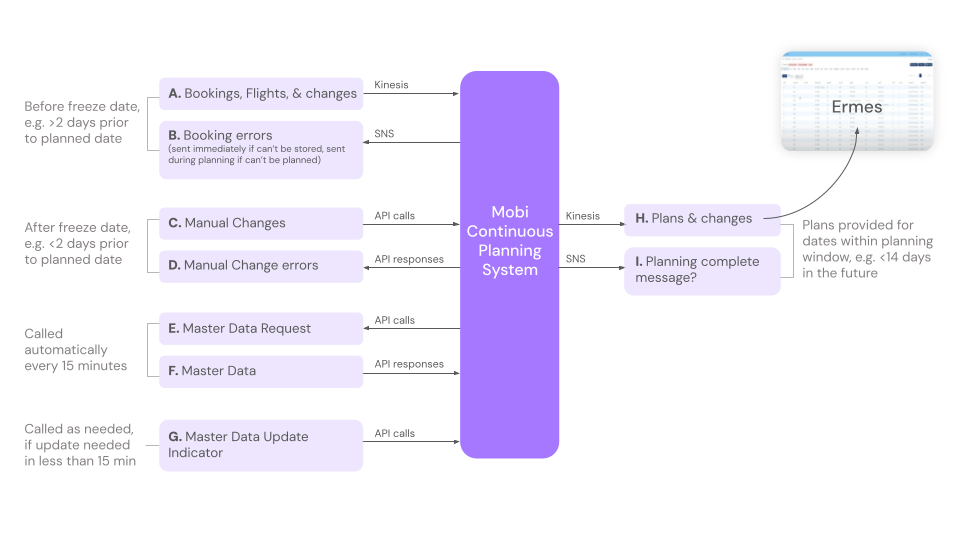

# Product Overview

The Continuous Planning Service enables TUI’s transfer service to operate efficiently by scheduling, optimizing, and routing TUI’s fleet from advanced pre-planning all the way to day-of operation. 

**[Charlie: Insert product overview diagram]**

# What We're Optimizing For

## Cost Functions

The Continuous Planning System optimizes for cost while following business rules. In order to optimize for cost, we must first define what cost is. Each destination has a specific cost function.

Example 1: Mallorca

Cost = distance travelled

Example 2: Zakynthos

Cost = (# of Vehicle A x cost of vehicle A) + (# of Vehicle B x cost of vehicle B)

In general, destinations where TUI owns their own fleet usually have a simple "distance traveled" cost function like Mallorca, and other destinations that are primiarily relying on suppliers have the more complex cost function like Zakynthos.

**[Ask Jacob: Is this how he'd represent Zakynthos cost function?]**

## Business Rules

The Continuous Planning System has been configured with business rules for each destination, in order to comply with local legislation, plan trips that are physically possible given the constraints of the geography, and ensure a great customer experience. The following business rules are applied in most destinations.

| Category            | Business Rule       | Definition                                                   | Usual Value | Specified Where? |
| ------------------- | ------------------- | ------------------------------------------------------------ | ----------- | ---------------- |
| Customer Experience | Max time in vehicle | A trip can only take X amount of time. Does not include time from the first/last stop to the airport. Only affects time between first and last hotel stops. (Minutes) | 40          | Master Data      |
|                     |                     |                                                              |             |                  |
|                     |                     |                                                              |             |                  |

**[To delegate: List all business rules & take a first pass at all values in the table.]**

# Data Exchange Overview

1. **Bookings, Flights, & changes:** TUI sends bookings, flights, & changes to Mobi on a continuous basis via an AWS Kinesis stream. All bookings, flights, & changes are sent this way up until the freeze date (e.g. 2 days prior to planned date).
2. **Booking errors:** If there is an error with a booking, this error is sent back to TUI via AWS SNS. An error may be sent immediately after the booking is received, if the booking could not be stored. If the booking can be stored but an error occurs later during planning, the error will be sent when planning occurs (either 14 days prior to the planned date, or soon after receipt of the booking if sent less than 14 days prior to the planned date).
3. **Manual Changes:** After the freeze date (e.g. <2 days prior to planned date), changes must be made manually via API call. This includes new bookings, changes to bookings, new trips, assigning bookings to trips manually, and requesting a replan.
4. **Manual Change errors:** When manual changes are made via API call, there may be errors, which prevent planning & must be addressed. There may also be warnings (which can be ignored if desired) if the manual changes violate QA rules. Both errors and warnings are sent in the API response.
5. **Master Data Request:** Mobi requests master data from TUI from each destination every 15 minutes, via an API call. This ensures that if there are changes on the TUI side (e.g. *NEED EXAMPLE) the changes will be part of Mobi’s planning. Master data includes elements like (e.g. *NEED EXAMPLES).
6. **Master Data:** In response to Mobi’s API call, TUI sends updated master data. (*DOES TUI SEND ALL OF IT? OR ONLY CHANGES?)
7. **Master Data Update Indicator:** If TUI needs the master data to be updated faster than 15 minutes, TUI can call the Master Data Update Indicator API. (*DO THEY EVER CALL THIS?)
8. **Plans & changes:** Mobi sends plans & changes to TUI via an AWS Kinesis stream. TUI consumes this data and displays it in the Ermes system.
9. **Planning complete message:** Mobi sends a planning complete message via AWS SNS (*DOES TUI USE THIS? WHEN & WHY?)

Each item in this diagram is further described in a section below.

# Bookings, Flights, Changes, & Errors

## Bookings

A booking represents a group of passengers (1 or more) who have booked a tour with TUI together, will be on the same flights, and will be staying at the same hotel. Each booking has properties like destination and number of passengers, as well as flight details.

Bookings generally have the following fields:

- (List out fields)

[Bookings List API, Example, & Schema](https://shiny-enigma-qklzoe7.pages.github.io/#/bookings/bookings_list)

**[Dan: Can field descriptions, e.g. for the fields in a booking, be autogenerated into the .yaml from code? If so let's set Charlie up to put them there.]**

**[To delegate: Validate that auto-generated booking schema matches what TUI sends us for bookings. We want to document TUI's actual interface with us.]**

**[To delegate: Create an example booking with values that illustrate the breadth of what a booking may contain.]**

## Flights

Each flight represents a real flight in the world on a specific day. Multiple bookings may correspond to a given flight. Flights generally have the following fields:

- (List out fields)

**[Jacob: Flights seem to also be part of the booking schema. Does TUI send us flights separately? Why? Do we use them?]**

## Changes

**[Jacob: How do booking changes work? What does it look like when they get sent? Send a booking & the id is the same & we just replace it?]**

Operations: ([from stream_processors.py])

- Saved
- Deleted
- Locked
- Unlocked

**[To delegate: example booking & booking change]**

## Errors

If there is an error with a booking, this error is sent back to TUI via AWS SNS. An error may be sent immediately after the booking is received, if the booking could not be stored. If the booking can be stored but an error occurs later during planning, the error will be sent when planning occurs (either 14 days prior to the planned date, or soon after receipt of the booking if sent less than 14 days prior to the planned date).

**[To delegate: Should we attempt to autogenerate errors & descriptions from code, for booking errors? Jamie says yes. Or describe manually, with detail on which ones might be sent when?]**

# APIs: Manual Changes, Requesting a Replan, Warnings, & Errors

## Manual Changes

After the freeze date (e.g. <2 days prior to planned date), changes must be made manually via API call. This includes new bookings, changes to bookings, new trips, assigning bookings to trips manually, and requesting a replan.

## Requesting a Replan

## Warnings

## Errors

# Master Data

**[To delegate: Identify where in the code what TUI sends us for master data is defined.]**

## Request

## Master Data Contents

## Master Data Update Indicator

# Plans & Changes

## Plans

## Changes

# (Notes to self)

We can link to other docs in this repo [another_file.md](./another_file.md)

Miscellaneous questions - check if we covered these:

- Once TUI sends us bookings, how will they know that we successfully planned or didn’t?
- How & when & in what format do we send error messages? (I think we send these via SNS).
- How do we send them back the plans? 
- What happens if they send us too many bookings at once? (like that one time they did this) How many do we expect they will send at maximum in what span of time, so they give us a heads up if they ever plan to send more?